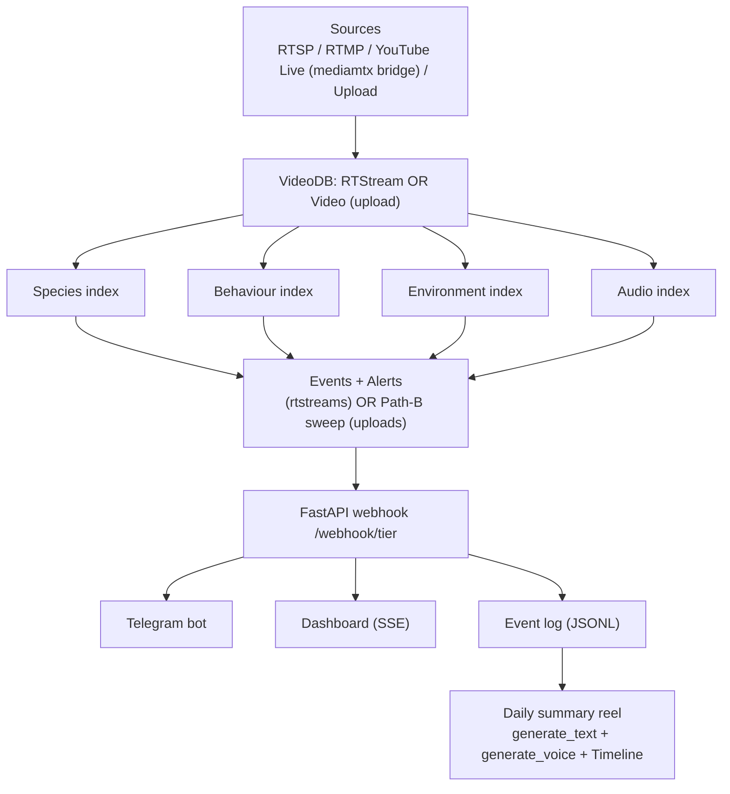

# WildWatch

**Real-time perception agent for protected-area wildlife monitoring.**

Continuous wildlife livestreams (and uploaded clips) → structured ecological observations — species, behavior, environment, threats — with tiered alerts, cross-modal reasoning, and a one-click daily narrated reel. Built end-to-end on the [VideoDB](https://videodb.io) SDK for the **Eyes & Ears** hackathon.

**Read next:**
- 🚀 [`docs/SETUP.md`](docs/SETUP.md) — **start here** — zero-to-first-alert walkthrough (15–30 min). Non-tech friendly. AI-tool friendly.
- 📁 [`docs/REPO_MAP.md`](docs/REPO_MAP.md) — every folder + file in one page.
- 🔀 [`docs/FEATURE_FLOWS.md`](docs/FEATURE_FLOWS.md) — diagrams of every feature.
- ⚠️ [`docs/GENAI_ROADMAP.md`](docs/GENAI_ROADMAP.md) — what's wired + the one platform limitation.

---

## What it does

Four AI "lenses" — species, behaviour, environment, audio — sit on top of every livestream or uploaded clip. When any lens spots something noteworthy, an alert lands on Telegram and the dashboard within seconds. Tier-coloured (🟢/🟡/🔴) with a tappable HLS clip of the actual moment.

**Cross-modal reasoning** suppresses single-signal noise: an alarm call **AND** fleeing animals within 90s escalates to red; either signal alone does not.

**Daily summary** stitches deduped highlights into a 90s reel — `generate_text` script + `generate_voice` narration + Timeline editor + QuickChart album to Telegram.

No in-house ML. Drop a new prompt file to add a new lens.

---

## Why this matters

- **286,000 rangers** manage 20M+ km² of protected land — one ranger per 72 km². IUCN target: one per 5 km². ~36% of needed workforce (Appleton et al., *Nature Sustainability* 2022).
- Camera infra has scaled into thousands. Snapshot Safari operates **800+ camera-trap stations** across Southern Africa — millions of images no human can watch live.
- Wildlife crime: **$7–23B/year** industry (UNODC) — 4th-largest international crime category.

**Gap:** cameras live + rangers undermanned 3×. Missing layer: automated perception turning feeds into actionable alerts. **WildWatch is that layer.**

### Per-camera math
- Run cost: ~$3,650/camera/year continuous AI monitoring
- Coverage: ~100% of camera output indexed vs ~5% spot-checked today
- Response time: seconds, not days
- Ranger time freed: ~5.5h/week/ranger redeployed from card-retrieval admin → ~7 effective rangers per 50-ranger reserve
- ROI on one rhino-poaching prevention: **~70–100× annual run cost**

Sources: Appleton et al. 2022 ([nature.com](https://www.nature.com/articles/s41893-022-00970-0)), UNODC World Wildlife Crime Report 2024, Re:wild/IUCN WCPA 2022, Pardo (Snapshot Safari) 2024, Mongabay 2025.

---

## Architecture



---

## VideoDB SDK depth

| Layer | Primitive | Use |
|---|---|---|
| See | `coll.connect_rtstream()` | Live RTSP (direct + YouTube-bridged) |
| See | `coll.upload()` | Uploaded clips + URL ingest |
| Understand | `rtstream.index_visuals()` / `video.index_scenes()` | Three visual lenses — separate indexes |
| Understand | `rtstream.index_audio()` / `video.index_audio()` | Audio lens (see limitation) |
| Understand | `rtstream.search()` / `video.search()` | Correlation + Path-B sweep |
| Act | `conn.create_event()` | 18 events defined ONCE, reused across streams |
| Act | `index.create_alert()` | Webhooks → FastAPI → Telegram |
| Act | `conn.connect_websocket()` | Optional dual delivery |
| Act | `*.generate_stream()` | Playable clip URLs per alert |
| Act | `coll.generate_text()` | Alert rewrite + 130–170 word digest script |
| Act | `coll.generate_voice()` | Narration via `voice_name="George"` slow ElevenLabs |
| Act | `coll.generate_music()` | Tail outro when narration < reel |
| Act | Programmable editor (`Timeline`, `Track`, `Clip`, `VideoAsset/AudioAsset/TextAsset`) | Daily reel composition |

One shared Medium `SandboxTier`, status-gated, 600s idle timeout. Built with the official [VideoDB Skills plugin](https://github.com/video-db/skills).

---

## Local setup

→ **[`docs/SETUP.md`](docs/SETUP.md)** — full 16-step walkthrough for non-tech / first-time setup. 15–30 min from zero to first Telegram alert. Includes:
- Per-OS terminal + Homebrew + Python install
- Step-by-step Telegram bot creation + `chat_id` extraction
- VideoDB API-key flow
- Cloudflare tunnel setup
- 11-row troubleshooting table

**TL;DR for engineers** (Mac, Homebrew + Python 3.12 already installed):

```bash
git clone https://github.com/skalkii/wildwatch.git && cd wildwatch
python3.12 -m venv .venv && source .venv/bin/activate
pip install -e ".[dev]"
cp .env.example .env   # fill VIDEO_DB_API_KEY + TELEGRAM_BOT_TOKEN + TELEGRAM_CHAT_ID
uvicorn wildwatch.webhooks:app --host 127.0.0.1 --port 8000 --reload
# (optional, in second terminal) cloudflared tunnel --url http://localhost:8000
```

**TL;DR for AI tools** (Claude Code, Cursor, etc.) — paste in repo root:

> Read `CLAUDE.md` + `docs/SETUP.md`. Install all prereqs for my OS, walk me through creating a Telegram bot, get my VideoDB API key, fill `.env`, start uvicorn + cloudflared in background, set `WEBHOOK_BASE_URL` to the tunnel URL, restart uvicorn, then fire a `/webhook/2` smoke test and confirm Telegram delivery.

Skip the tunnel for the upload-only demo — Path-B sweep fires locally.

---

## Demo flow (no live feed)

1. Dashboard → Sources → **+ Add source** → upload file OR paste YouTube URL.
2. Wait for `ready` (1–3 min). Card pulses `queued → connecting → ingesting → indexing → ready`. Auto scene + audio indexing starts on upload completion.
3. Watch Alerts feed. Path-B sweep searches each index for gunshot / chainsaw / rare-species / alarm-call / human-intrusion and fires synthesised webhooks. Dashboard fills instantly via SSE; **Telegram lands ~3–10 s later** because each alert goes through `coll.generate_text` to rewrite raw bracket-tagged AI output into a human-readable sentence (8 s timeout → falls back to local parser).
4. (Optional) Alerts tab → **Test the alert system** → 🟢/🟡/🔴 buttons sanity-check Telegram.
5. Alerts tab → **Daily summary → Build** (30–90s):
   - Reads last 24h from `data/live_event_log.jsonl`
   - Dedupes `(label, source[:48], 60s bucket)` → top 10 by tier + recency
   - `compute_analytics` → KPIs + top species + hourly + categories
   - Timeline reel from real triggering scene (Path-B `video_id`+`start`) or corpus fallback; clip audio muted
   - `coll.generate_text` 130–170 word narrator script
   - `coll.generate_voice` (George voice, speed=0.85) narrates; reel extended or tail-music padded to match
   - Returns `{player_url, stream_url, summary, analytics, n_clips, n_events}`
6. Modal opens: 4-up KPI strip, 2×2 charts (hourly bar, species donut, event-mix donut, top-labels bar), inline HLS reel, narration transcript. Modal palette flips with light/dark toggle.
7. Telegram album lands — same content as modal: `sendMediaGroup` of 4 charts (QuickChart.io PNGs) with KPI caption + narration + reel link.

Total: ~3 minutes once a clip is uploaded.

---

## Live feeds (optional)

VideoDB accepts `rtsp://` / `rtmp://` only for live; YouTube serves HLS. Bridge module (mediamtx + bore + streamlink + ffmpeg) plugs the gap.

Full setup, codec caveat, bore-port rotation, teardown: **[`bridge/README.md`](bridge/README.md)**.

Three-step summary:
1. `docker compose -f bridge/docker-compose.yml up -d`
2. `./bridge/start_bridge.sh "<youtube_url>" <slug>`
3. Dashboard → **+ Add source → RTSP** → `rtsp://bore.pub:<port>/<slug>`

Live feeds mostly empty (sleepy waterholes). Demo flow uses uploads precisely because of this.

---

## Known limitations

See [`docs/GENAI_ROADMAP.md`](docs/GENAI_ROADMAP.md). Summary:

- **VideoDB has no native non-speech audio classification.** `video.index_audio(prompt=…)` is transcript-based — hangs `processing` forever on silent / SFX-only clips. Dashboard surfaces this with an amber "no speech — skipped" pill. Path-B sweep falls back to running audio-event queries against the visual scene index.
- **bore.pub rotates remote port** on every reconnect — manual re-wire needed.
- **macOS Docker Desktop** doesn't expose `network_mode: host` — `bridge/docker-compose.yml` uses explicit port mappings.

---

## Security defences

- **CSRF / Origin guard** — `/api/*` mutating requests need `Origin`/`Referer` matching localhost or `WILDWATCH_ALLOWED_ORIGINS`. `/webhook/*` exempt. CLI: `WILDWATCH_ALLOW_NO_ORIGIN=1`.
- **SSRF guard** — per-kind scheme allowlist + `_host_is_private(host)` blocks loopback/private/link-local in both textual and IPv4-mapped IPv6 form. `file:` / `gopher:` / `javascript:` rejected.
- **Optional webhook auth** — `WILDWATCH_WEBHOOK_SECRET=…` requires `X-WildWatch-Secret` on `/webhook/{tier}` (`hmac.compare_digest`). Path-B + correlation forward the header.
- **Payload caps** — label 256 / explanation 8000 / input 2000.
- **Upload rate limit** — token bucket, 3 capacity / 1 refill per minute per IP. `WILDWATCH_TRUSTED_PROXY=1` reads `X-Forwarded-For`.
- **MIME sniff + atomic rename** — first 32 bytes must match a video container. `.partial` → `.mp4` only after sniff passes. Rejected uploads delete the orphan source row + broadcast `source_deleted`.
- **SDK pool saturation** — 4-worker bounded; 2× saturation → `SDKPoolSaturated → 503`.
- **State file** — `0o600`, `O_NOFOLLOW`, `fsync` + parent fsync.
- **Telegram rewrite cache** — `OrderedDict` + `threading.Lock`.

---

## State

`.state.json` — atomic writes, single-process safe. `data/live_event_log.jsonl` — append-only alert log used by digest builder.

## Tests

```bash
pip install pytest pytest-asyncio pytest-mock respx httpx
pytest
```

Per-module coverage: [`docs/REPO_MAP.md`](docs/REPO_MAP.md) §6.

## License

MIT. See [`LICENSE`](LICENSE).
