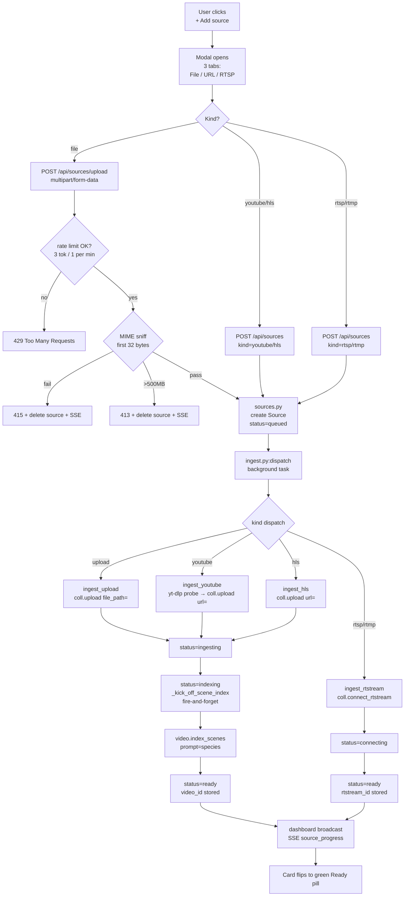
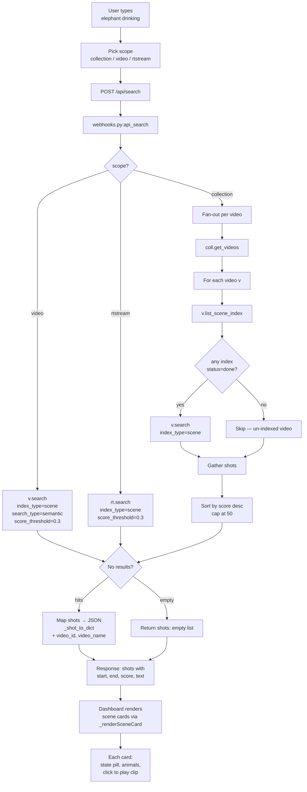
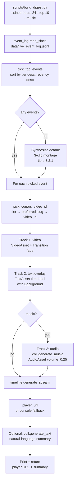
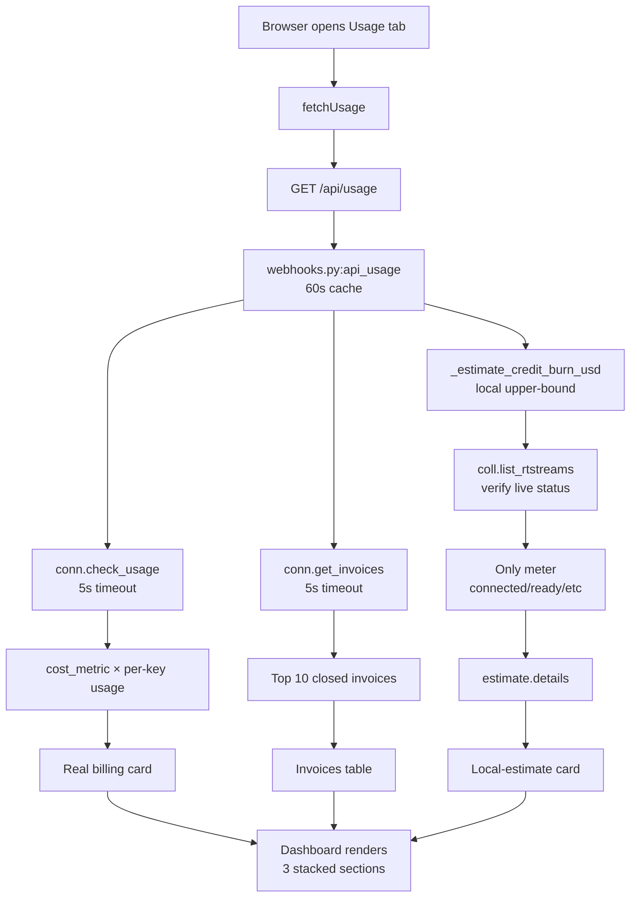
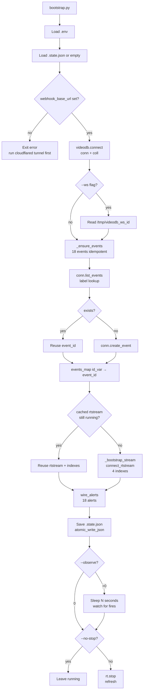

# Feature Flows — How everything actually happens, step by step

> **Audience:** anyone wanting to understand how WildWatch *behaves* — not just where the files live (that's `REPO_MAP.md`) but the end-to-end "thing happens → thing happens → thing happens" sequence behind every visible feature.

GitHub renders Mermaid diagrams natively, so the charts below will appear as drawn pictures when you read this file on GitHub. The numbered walkthroughs after each chart explain every step in plain English with a pointer to the exact source-code location.

---

## Flow 1 — A wild animal is seen, a phone buzzes

The headline pipeline. From "camera films a leopard" to "ranger's Telegram buzzes" in under 30 seconds.

```mermaid
flowchart TD
    A[Wildlife livestream<br/>HDOnTap RTSP / YouTube Live] -->|RTSP URL| B(VideoDB<br/>connect_rtstream)
    B --> C{Sandbox<br/>active?}
    C -->|no| D[sandbox.py<br/>create + wait_for_ready]
    C -->|yes| E
    D --> E[Frames arrive in VideoDB]
    E --> F1[Species index<br/>prompts/species.txt<br/>every 5s]
    E --> F2[Behavior index<br/>prompts/behavior.txt<br/>every 5s]
    E --> F3[Environment index<br/>prompts/environment.txt<br/>every 60s]
    E --> F4[Audio index<br/>prompts/audio.txt<br/>every 30s]
    F1 --> G{18 event rules<br/>events.py}
    F2 --> G
    F3 --> G
    F4 --> G
    G -->|match| H[VideoDB fires alert<br/>POST callback_url]
    H --> I[webhooks.py<br/>POST /webhook/&#123;tier&#125;]
    I --> J[event_log.py<br/>append JSONL]
    I --> K[telegram.py<br/>send_alert]
    I --> L[dashboard.py<br/>broadcast SSE]
    K --> M[Operator's<br/>Telegram chat]
    L --> N[Browser dashboard<br/>live event feed]
```



### Node-by-node

1. **Wildlife livestream** — an HDOnTap RTSP stream or a YouTube Live URL bridged through `mediamtx` so VideoDB can read it. URLs and per-stream context (location, expected species) are configured in `config.py`.
2. **VideoDB `connect_rtstream`** — the SDK call that hands the stream over to VideoDB's ingest. Invoked from `scripts/bootstrap.py:_bootstrap_stream`. The returned `rt` object is the handle we use for every subsequent index/alert.
3. **Sandbox check** — VideoDB charges per-hour for a "sandbox" — the dedicated GPU slot that runs perception models. We use exactly one, lazily created, status-gated. Logic in `wildwatch/sandbox.py`.
4. **Sandbox creation** — if no sandbox exists or the cached one expired (10-min idle TTL on VideoDB's side), `sandbox.py:ensure_sandbox` creates a new one and blocks until `is_active == True`. This is the only place sandbox lifecycle lives — every other module accepts a `sandbox_id` parameter.
5. **Frames arrive in VideoDB** — once `rt.status == "connected"` you can ask for indexes.
6–9. **Four parallel indexes** — `rt.index_visuals(prompt=...)` is called three times (species, behavior, environment) and `rt.index_audio(prompt=...)` once. Each one is a separate AI "lens" with its own batch frequency. Code: `scripts/bootstrap.py:_bootstrap_stream` lines 158–180.
10. **18 event rules** — defined as a list of dicts in `wildwatch/events.py`. Each event has a tier, a label, and a prompt sentence that VideoDB's event engine evaluates against incoming index outputs. Wired to indexes by `wildwatch/wiring.py:wire_alerts`.
11. **VideoDB fires the alert** — when an event matches, VideoDB POSTs to whatever `callback_url` was registered when the alert was created. For us that's `https://<tunnel>/webhook/{tier}`.
12. **`/webhook/{tier}` receiver** — `wildwatch/webhooks.py:receive_alert` accepts the POST, validates the payload schema (`AlertPayload`), and starts fan-out.
13. **Append to event log** — `wildwatch/event_log.py:append` writes the alert as one JSON line. This file is the digest builder's source of truth.
14. **Send to Telegram** — `wildwatch/telegram.py:send_alert` formats a markdown message with tier emoji, label, explanation, and a clickable VideoDB player link. Posts to the Telegram Bot API.
15. **Broadcast to dashboard** — `wildwatch/dashboard.py:broadcast` pushes the event to every SSE subscriber (every open browser tab on the dashboard). Slow subscribers get dropped events (counted in `/api/stats`).
16. **Operator's Telegram chat** — the phone buzzes.
17. **Browser dashboard** — the new event card appears at the top of the live feed (fade-in animation), the tier counter increments, KPI updates.

---

## Flow 2 — Operator adds a new source from the dashboard

A user pastes a YouTube URL, uploads an MP4, or types in an RTSP address. The dashboard walks the source from "queued" all the way to "ready and searchable."



### Node-by-node

1. **User clicks +Add source** — button in the Sources tab (`dashboard.py` near the `add-source-btn` id).
2. **Modal opens** — three-tab modal: file upload, URL paste, RTSP/RTMP. The active tab is tracked in JS (`modalKind`).
3. **Kind dispatch** — the front-end picks the right endpoint and body shape. URL-paste auto-detects YouTube vs HLS by domain.
4. **Upload-only: per-IP rate limit** — `_upload_rate_limit_check(client_ip)` in `webhooks.py`. Token bucket, capacity 3, refill 1/min. Returns `429` over the cap. `_client_ip_from` honours `WILDWATCH_TRUSTED_PROXY=1` to use the first `X-Forwarded-For` IP instead of the TCP peer (normalised to strip `[ ]` brackets + `:port` so token rotation can't mint distinct keys). `client_ip == "unknown"` bypasses with a startup warning rather than collapsing every unknown-peer into one shared bucket.
5. **Upload-only: MIME magic-byte sniff** — `_looks_like_video(chunk[:32])`. Allow list: `mp4` / `mov` / `webm` / `mkv` / `avi` / `mpeg-ps` / `flv`. MPEG-TS deliberately excluded. Miss → `415`. After-read size cap `>= 500 MB` → `413`. BOTH rejection paths delete the orphan source row AND broadcast a `source_deleted` SSE event so the dashboard card disappears immediately.
6. **POST endpoint** — `webhooks.py:api_create_source` (JSON) or `webhooks.py:api_upload_source` (multipart).
7. **Source created** — `sources.py:add_source` writes a new entry to `.state.json["sources"][<uuid>]` with `status="queued"`.
8. **Dispatch background task** — `webhooks.py:_spawn_bg(ingest.dispatch(source_id, coll))`. The task is tracked in a Set so the garbage collector doesn't drop it mid-flight; the `done_callback` logs any exception.
9–12. **Per-kind handler** — `ingest.py` has four dispatch branches:
    - `ingest_upload`: streams the temp file to VideoDB via `coll.upload(file_path=...)`.
    - `ingest_youtube`: probes the URL with `yt-dlp` first to surface 403s before billing VideoDB, then `coll.upload(url=...)`.
    - `ingest_hls`: HEAD-checks the manifest, then `coll.upload(url=...)`.
    - `ingest_rtstream`: `coll.connect_rtstream(url=..., media_types=["video","audio"], store=True)` and waits for `status="connected"`.
13–14. **Progress states** — each handler updates the source's `status` field (`queued → connecting → ingesting → indexing → ready`) and broadcasts a `source_progress` SSE event after every change.
14b. **Auto scene-index + audio-index (uploads + URLs only)** — `ingest.py:_kick_off_scene_index(video, source_id)` fires `video.index_scenes(prompt=species, name=wildwatch-auto-<src8>)` AND `_kick_off_audio_index_async` fires `video.index_audio(prompt=audio, name=wildwatch-audio-<src8>)`. Both are idempotent and best-effort. The actual indexing runs on VideoDB's side and shows up as `processing` → `done` when the dashboard polls `/api/videos/{id}/scenes/{index_id}`. Operators can force a fresh visual index via the Re-index button (calls `POST /api/videos/{id}/reindex`) or via `python scripts/index_corpus.py` for the corpus.
14c. **Post-upload auto-analysis (Path B alerts)** — immediately after `_emit("ready", …)`, `_spawn_post_upload_analysis(video, source_id)` kicks `wildwatch/post_upload_analysis.py:run_post_upload_analysis` as a tracked asyncio task. That task polls both indexes until `done`, runs `video.search(query, index_type=scene, scene_index_id=…, score_threshold=0.35)` for each event-of-interest (gunshot, chainsaw, rare species, alarm calls, etc.) and POSTs a synthesised payload to `/webhook/{tier}` for every hit — flowing through the same Telegram + dashboard SSE pipeline as VideoDB-fired rtstream alerts. Capped at 12 fires per upload. This works around the SDK limitation that `create_alert` only attaches to rtstream indexes.
15–16. **Ready** — the source now has a `video_id` (for uploads/URLs) or `rtstream_id` (for live streams) and is searchable.
17. **Card flips to ready** — the dashboard re-fetches `/api/sources` on `source_progress` AND on `source_deleted`, so both happy-path and rejection-path UI updates are instant.

### Per-kind action buttons

Once a source is `ready`, the action row on its card depends on `kind`:

- **`rtsp` / `rtmp`** — shows **Reconnect** + **Disconnect** + **Delete**. Reconnect re-runs `coll.connect_rtstream(...)` against the same upstream URL — useful when the live feed drops or the bridge container restarts. Disconnect stops the rtstream on VideoDB but keeps the source row so you can re-enable it later.
- **`upload`** — shows **Re-index** + **Delete**. Reconnect is hidden because the local temp file is gone after the first ingest; re-running it would just fail. Re-index calls `POST /api/videos/{video_id}/reindex` which fires a fresh `video.index_scenes(...)` on the existing video.
- **`youtube` / `hls`** — shows **Re-index** + **Delete**. Reconnect is hidden because re-running `coll.upload(url=...)` would create a duplicate VideoDB video, wasting credits and cluttering the library. Re-index does the right thing on the already-uploaded copy.

This split is enforced in `dashboard.py:renderSource` via the `isStreamKind` boolean. Tooltips on every button explain what it does.

---

## Flow 3 — Search "elephant drinking"

The operator types a phrase into the Indexed Content tab. Behind the scenes, VideoDB's per-scene index does the heavy lifting — but the collection-scope path is **not** what you'd naively expect.



### Node-by-node

1. **User input** — the search box at the top of the Indexed Content tab (`dashboard.py`, `search-q` id).
2. **Scope picker** — three options, all rewritten in plain English on the dashboard ("Search everywhere" / "A specific uploaded video" / "A specific live stream").
3. **POST request** — JSON body: `{query, scope, target_id?, index_id?}`.
4. **Receiver** — `webhooks.py:api_search`.
5. **Scope dispatch — video / rtstream** — call `v.search` / `rt.search` with `index_type=IndexType.scene`, `search_type=SearchType.semantic`, and `score_threshold=0.3` per the VideoDB skill's reference docs.
6. **Scope dispatch — collection (CRITICAL)** — `coll.search` only supports `SearchType.semantic` over the **spoken-word** index (the SDK explicitly raises `NotImplementedError` for keyword/scene at collection level). Wildlife clips have no transcripts → `coll.search` always returns zero. The skill's prescription is: *"For keyword or scene search, use `video.search()` on individual videos instead."* So collection-scope search **fans out**: enumerate `coll.get_videos()`, filter to videos whose `v.list_scene_index()` has at least one entry in `{ready, done, complete, completed, indexed}`, and call `v.search(index_type=scene, search_type=semantic, score_threshold=0.3)` on each — concurrently via `asyncio.gather`.
7. **Merge + rank** — gather all per-video shots into one list, sort by score descending, cap to `result_threshold` (default 50). Each shot is backfilled with `video_id` + `video_name` so the dashboard can show "which video did this match" and route a click-to-play to the right segment.
8. **Empty-result handling** — VideoDB raises a custom exception when nothing matches (string contains `"No results found"`). The fan-out catches this per-video and treats it as `[]` so one un-matching video doesn't blow up the whole sweep.
9. **Normalize shots** — `_shot_to_dict` extracts `start`, `end`, `score`, `text`, `scene_index_name`, `scene_index_id`.
10. **Response** — `{scope, shots, videos_searched?}` JSON to the front end.
11. **Dashboard rendering** — `dashboard.py:search-go` reuses `_renderSceneCard(synthetic, idx, video_id)` so each search hit reads the same as a scene in the Indexed Content tab — bracket-tagged AI text turns into pills (light mode, scene state, animal count) + per-animal rows + notes, and the card is clickable into the modal HLS player (Flow 9).

---

## Flow 4 — Cross-modal correlation ("confirmed predator event")

Single-signal alerts are noisy. This loop fires only when **two independent signals** agree within a time window — the "perception agent reasons across modalities" pitch.

```mermaid
flowchart TD
    A[scripts/run_correlation.py<br/>--stream mara_live] --> B[Load .state.json<br/>resolve rtstream + index ids]
    B --> C[Every 30s sweep]
    C --> D[For each rule in CORRELATION_RULES]
    D --> E{Cooldown OK?}
    E -->|no| C
    E -->|yes| F[For each query in rule]
    F --> G[rt.search<br/>per-index<br/>time_range=last N s]
    G --> H{All queries<br/>have hits?}
    H -->|no| C
    H -->|yes| I[Build synthesised event]
    I --> J[rt.generate_stream<br/>start=fired_at-window<br/>end=fired_at]
    J --> K[POST /webhook/&#123;tier&#125;<br/>label=CONFIRMED_PREDATOR_EVENT<br/>stream_url=playable clip]
    K --> L[Normal alert pipeline<br/>Telegram + dashboard]
    L --> M[Mark rule fired<br/>start cooldown]
    M --> C
```



### Node-by-node

1. **Entry point** — `python scripts/run_correlation.py --stream <key> --interval 30 --duration 300`.
2. **State load** — reads `.state.json` to find the rtstream id and per-kind index ids for the named stream.
3. **30-second sweep loop** — configurable. Each tick walks every correlation rule.
4. **Rule iteration** — rules are defined in `scripts/run_correlation.py:CORRELATION_RULES` (or imported from `wildwatch/correlation.py`).
5. **Cooldown check** — `should_fire(rule_name, now, cooldown=300)` prevents the same rule from firing twice in 5 minutes.
6. **Per-query iteration** — each rule has 2+ queries, each tagged with which index it runs against. Example: `("audio", "alarm_call OR predator_vocalization")` paired with `("behavior", "fleeing OR alarm_response")`.
7. **`rt.search`** — VideoDB scene search, time-windowed to the rule's window (typically 90 s).
8. **All-match check** — the rule only fires if *every* query has at least one hit. AND-logic across modalities.
9. **Synthesised event** — builds the payload: `event_id = "corr-<rule>-<ts>"`, `label = rule.synthesis_label`, evidence summary in `explanation`.
10. **Generate playable clip** — `rt.generate_stream(start=fired_at - window_s, end=fired_at)` returns an HLS URL pointing at the actual moment. Attached as `stream_url` so the Telegram message has a tap-to-play link.
11. **POST to our own webhook** — the synthesised event flows through the same `/webhook/{tier}` pipeline as VideoDB-fired ones. Same logging, same Telegram, same dashboard broadcast. No special-case downstream code.
12. **Normal alert pipeline** — Flow 1 from step 12 onwards.
13. **Cooldown set** — `mark_fired(rule_name, at=now)` so the rule rests for `--cooldown` seconds.

---

## Flow 5 — Daily highlight reel

End-of-day operator hits "build digest" (or a cron does). 90 seconds later there's a playable, narrated, music-backed reel of the day's most important events.



### Node-by-node

1. **Entry point** — `python scripts/build_digest.py --since-hours 24 --top 10 [--music] [--no-overlays]`.
2. **Read event log** — `wildwatch/event_log.py:read_since` reads `data/live_event_log.jsonl` and returns every event with `received_at >= now - since_hours*3600`. Tolerates malformed lines (skips them with a warning).
3. **Pick top events** — `digest.py:pick_top_events` sorts by `(-tier, -received_at)` and keeps the first N. Urgent events ALWAYS appear before notable ones.
4. **Empty-log fallback** — if no events fired today, build a default 3-clip montage (one per tier) so the demo always has a reel to show.
5. **Event iteration** — one clip per picked event.
6. **Pick corpus clip** — `digest.py:pick_corpus_video_id` maps the event's tier to a list of preferred corpus slugs (from `TIER_SLUG_PREFERENCE`) and returns the first that has a `video_id` in `state["corpus"]`. Falls back to "any clip" if no slug matches.
7. **Track 1 — video** — `VideoAsset(id=video_id, start=0)` wrapped in a `Clip(duration=4s, transition=fade-in/out)`. Added to the video `Track`.
8. **Track 2 — text overlay** — `TextAsset(text="🟦 INFO\n<event label>", font=…, background=…)` with the same fade transition. The tier color (#38bdf8 / #f59e0b / #ef4444) sets the background. Renders as a burn-in label so a non-tech viewer instantly understands what each clip represents.
9–10. **Track 3 — music (optional)** — `coll.generate_music(prompt="documentary ambient...", duration=total)` returns an `Audio` object whose id we wrap in `AudioAsset(volume=0.25)`. Failure is non-fatal — the reel just plays silent.
11. **Generate stream** — `timeline.generate_stream()` is VideoDB's "compile and serve" call. Returns an HLS URL.
12. **Player URL** — preferred path is `timeline.player_url` (skill convention). Fallback to hand-built `console.videodb.io/player?url=...`.
13. **Natural-language summary (optional)** — `coll.generate_text(prompt="Summarise this digest in one paragraph...")` produces a one-paragraph caption for the reel. Failure is silent.
14. **Output** — prints both URL and summary; returns them in the result dict.

---

## Flow 6 — Dashboard live updates (SSE)

The dashboard never polls for alerts. New events push from server to browser through a Server-Sent Events stream.

```mermaid
flowchart TD
    A[Browser opens<br/>http://localhost:8000/] --> B[Page loads HTML/JS]
    B --> C[startSSE<br/>new EventSource<br/>/events/stream]
    C --> D[webhooks.py<br/>stream_events]
    D --> E[dashboard.subscribe<br/>asyncio.Queue]
    E --> F[Listening...]
    G[Alert arrives at<br/>/webhook/&#123;tier&#125;] --> H[dashboard.broadcast]
    H --> I[For each subscriber Queue]
    I --> J[put_nowait event]
    J --> K{Queue full?}
    K -->|yes| L[Drop + log<br/>increment _dropped_total]
    K -->|no| M[Yield to client]
    M --> N[Browser onmessage]
    N --> O[Refresh feed via<br/>fetchStats]
    F --> M
```



### Node-by-node

1. **Browser opens** — index page served from `webhooks.py:dashboard_index`.
2. **Page loads** — embedded JS in `dashboard.py` runs `applyThemeIcons`, `restoreTab`, `startSSE`, `fetchStats`, etc.
3. **EventSource connect** — `new EventSource('/events/stream')` opens a long-lived HTTP connection.
4. **Server endpoint** — `webhooks.py:stream_events` returns a `StreamingResponse` whose generator is `dashboard.py:subscribe`.
5. **Subscribe** — a new `asyncio.Queue(maxsize=...)` is added to `_subscribers`. The generator `async for ev in subscribe()` yields each event back to the browser as it arrives.
6. **Idle wait** — the queue is empty; the generator blocks.
7. **Alert arrives** — Flow 1, step 12. `webhooks.py:receive_alert` calls `dashboard.broadcast(payload)`.
8. **Broadcast fan-out** — iterates every subscriber queue and `put_nowait`s the event.
9–10. **Slow-subscriber handling** — if a browser tab is too slow to drain (queue full), the event is **dropped** and `_dropped_total` is incremented + logged. We deliberately don't block the webhook handler on slow clients.
11–12. **Browser receives** — `EventSource.onmessage` fires.
13. **Refresh** — the JS calls `fetchStats()` which re-renders the live feed. The keyed-render diff in `applyStats` only appends new events (no full re-render flicker).

---

## Flow 7 — Cost & usage breakdown

The Usage tab shows three layers of cost info, each derived from a different VideoDB API.



### Node-by-node

1. **Browser opens Usage tab** — triggers `fetchUsage()`.
2. **Single GET** — `/api/usage` returns all three layers in one response (cached 60 s server-side).
3. **Server handler** — `webhooks.py:api_usage`.
4. **Three parallel data sources** — all dispatched through `_async_sdk(fn, timeout_s=5.0)` which submits to a bounded 4-worker SDK thread pool and wraps the result with `asyncio.wait_for` so a hung VideoDB call can't park the event loop. The pool tracks `_sdk_in_flight` under `_executor_lock`; at 2× saturation new calls raise `SDKPoolSaturated → 503` rather than queueing forever. Timeout / cancel paths defer the slot release via `cf_fut.add_done_callback` so the counter doesn't leak while a worker is still pinned.
    - **`_estimate_credit_burn_usd`** — local upper-bound from `.state.json` start timestamps × hourly rate. Cross-checked against `coll.list_rtstreams()` to skip non-running entries.
    - **`conn.check_usage()`** — VideoDB's real per-period total + price card + balance + plan. Feeds the per-resource cost breakdown card.
    - **`conn.get_invoices()`** — list of closed billing periods. Normalised by `_coerce_to_list` (not `or []`) so a non-list SDK return logs a warning instead of silently zeroing.
5. **Live-status verification** — for each `rtstreams` entry in `.state.json`, only meter it if VideoDB confirms it's in `connected/running/ingesting/indexing/ready` state. Stale entries are skipped. If the SDK call fails, fall back to the legacy upper-bound and emit a `warning` field so the dashboard can show a banner.
6. **Real-billing math** — for each `key` in `cost_metric`, compute `usage[key] × cost_metric[key]`. Sort descending. This is the breakdown that exposes the "transcription = $96" surprise from prior smoke runs.
7. **Closed-invoice list** — top 10 invoices, normalised to a `{description, when, amount}` shape by `dashboard.py:renderInvoices`.
8–10. **Three cards rendered**: real-billing breakdown (top), local-estimate (middle), invoices (bottom). The technical-details `<details>` element holds the raw SDK JSON for engineers.

---

## Flow 8 — Bootstrap (one-shot wire-up)

What happens when you run `python scripts/bootstrap.py [--observe 60]` on a clean repo. The script is idempotent — re-running it never duplicates events or alerts.



### Node-by-node

1. **Entry** — `python scripts/bootstrap.py --observe 60 [--ws]`.
2. **Load env** — `.env` → `VIDEO_DB_API_KEY`, `TELEGRAM_*`, optional `WILDWATCH_ALLOWED_ORIGINS`.
3. **Load state** — `.state.json` if present, otherwise empty dict.
4. **Tunnel check** — refuse to proceed if no `webhook_base_url`; otherwise the alerts we create would point at a dead URL.
5. **VideoDB connect** — `videodb.connect()` + `get_collection()`. Cached for the rest of the script.
6. **Optional WebSocket id** — if `--ws`, read `/tmp/videodb_ws_id` written by `wildwatch/ws_listener.py`. This id gets threaded through every subsequent index and alert call.
7. **`_ensure_events`** — pre-fetches `conn.list_events()` once, then for each of the 18 definitions in `wildwatch/events.py`: if a same-labelled event already exists, reuse its id; otherwise `conn.create_event()`. Saves the mapping into `state["events"]`.
8. **Idempotent rtstream** — if a previous bootstrap saved an rtstream id and it's still `connected`, reuse it. Otherwise call `_bootstrap_stream` to provision a fresh one with all four indexes.
9. **`_bootstrap_stream`** — `rt = coll.connect_rtstream(url, media_types=["video","audio"], store=True)`, then four index calls in order (species → behavior → environment → audio). If `--ws`, also calls `rt.start_transcript(ws_connection_id=...)`.
10. **`wire_alerts`** — `wildwatch/wiring.py`. For each `(kind, event)` pair in `INDEX_EVENT_MAP`, creates an alert with `callback_url=f"{base_url}/webhook/{tier}"`. Idempotency keyed on `rtstream_id`. WebSocket id forwarded if present.
11. **Save state** — `wildwatch/state_io.py:atomic_write_json` writes `.state.json` durably.
12. **Observe loop** — if `--observe > 0`, sleeps that many seconds while alerts may fire.
13. **Teardown** — `rt.stop()` and `rt.refresh()` unless `--no-stop` is set.

---

## Flow 9 — Click a scene card → modal video player

Every scene card (both in the Indexed Content tab and in search results) is clickable. Tap it and the matching segment of the video plays inline in a modal — no new tabs, no raw m3u8 manifests, no rabbit-holing into VideoDB's player URL scheme.

```mermaid
flowchart TD
    A[User clicks scene card<br/>data-action=play-scene-clip] --> B[Central click dispatcher<br/>dashboard.py]
    B --> C[playSceneClip&#40;videoId, start, end&#41;]
    C --> D[showToast 'Generating clip URL…']
    D --> E[GET /api/videos/&#123;id&#125;/clip<br/>?start=...&end=...]
    E --> F[webhooks.py:api_video_clip]
    F --> G{end-start<br/>≤ 600s?}
    G -->|no| H1[400 segment too long]
    G -->|yes| H2[coll.get_video]
    H2 --> H3[video.generate_stream<br/>timeline=&#91;&#40;start,end&#41;&#93;]
    H3 --> I[m3u8 manifest URL]
    I --> J[Response: stream_url]
    J --> K[_openClipPlayer&#40;url, title&#41;]
    K --> L{Safari?}
    L -->|yes| M1[video.src = url<br/>native HLS]
    L -->|no| M2[Hls.isSupported&#40;&#41;?]
    M2 -->|yes| M3[new Hls&#40;&#41;<br/>loadSource + attachMedia]
    M2 -->|no| M4[showToast 'HLS not supported']
    M1 --> N[Modal opens<br/>video controls autoplay]
    M3 --> N
    N --> O[Esc / backdrop / X<br/>cleanup hls + dom]
```



### Node-by-node

1. **Click target** — every scene card is rendered with `data-action="play-scene-clip"`, `data-video-id`, `data-start`, `data-end` attributes via `_renderSceneCard(sc, idx, videoId)` in `dashboard.py`.
2. **Central dispatcher** — a single delegated click listener (`document.addEventListener('click', ...)`) walks `e.target.closest('[data-action]')` and switches on `t.dataset.action`. `play-scene-clip` calls `playSceneClip(videoId, start, end)`.
3. **`playSceneClip(videoId, start, end)`** — shows an in-flight toast (`showToast(msg, {variant:'info', duration:0})`), then fetches the clip URL.
4. **`GET /api/videos/{id}/clip`** — query params `start` and `end`. Rejects `end <= start` (400) and segments longer than 600s (400 — scenes are seconds, not hours).
5. **`webhooks.py:api_video_clip`** — looks up the video via `_async_sdk(coll.get_video, ...)` and calls `_async_sdk(video.generate_stream, timeline=[(start, end)])`. The SDK returns a fresh HLS manifest scoped to that interval.
6. **Response** — `{video_id, start, end, stream_url}` JSON.
7. **`_openClipPlayer(url, title)`** — builds a modal DOM: backdrop overlay + card with `<video controls autoplay playsinline>` + close button + manifest fallback link.
8. **HLS branch — Safari** — `<video>` natively plays `application/vnd.apple.mpegurl`, so set `video.src = url` directly.
9. **HLS branch — every other browser** — load `hls.js@1.5.13` (CDN'd alongside Tailwind), construct `new Hls({ maxBufferLength: 30 })`, `loadSource(url)`, `attachMedia(video)`. Fatal player errors surface through `showToast`.
10. **Cleanup** — Esc, X button, or clicking the backdrop calls `cleanup()`: destroys the hls.js instance, pauses + nullifies `<video>` src, removes the DOM nodes, detaches the keydown listener. No leaked players, no leaked media decoders.

> **Why a modal player and not `window.open(m3u8)`?** Raw m3u8 manifests don't render in plain browser tabs (no built-in HLS in Chrome/Firefox; Safari downloads it). Embedding hls.js inside the dashboard gives the operator inline playback with controls and looks like a real ops tool instead of a "here's a download" flow.

---

## Flow 10 — Library: browse, filter, sort, delete

The Library panel inside the Indexed Content tab lists every video VideoDB knows about. The toolbar at the top (filter / sort / kind) runs entirely in the browser against a cached payload so changing any control re-renders instantly without hitting the API. The list scrolls inside the card with the toolbar pinned to the top.

```mermaid
flowchart TD
    A[Indexed Content tab opens] --> B[fetchVideos]
    B --> C[GET /api/videos]
    C --> D[webhooks.py:api_list_videos<br/>60s cache]
    D --> E[Response: { videos: [...] }]
    E --> F[Client cache _libraryVids]
    F --> G[_renderLibrary]
    G --> T0[Sticky toolbar:<br/>filter / sort / kind]
    G --> T1[Scrollable list of cards]
    T0 -->|input/change| H[_renderLibrary again<br/>no API call]
    H --> T1
    T1 -->|click row| I[showVideoDetail<br/>indexes + scenes]
    T1 -->|click delete| J[deleteVideo]
    J --> K[confirmToast danger]
    K -->|cancel| K0[Stop]
    K -->|confirm| L[showToast 'Deleting…']
    L --> M[DELETE /api/videos/&#123;id&#125;]
    M --> N[webhooks.py:api_delete_video]
    N --> O[coll.delete_video&#40;id&#41;]
    O --> P[_videos_cache reset]
    P --> Q[dashboard.broadcast<br/>type=video_deleted]
    Q --> R[Optimistic local filter +<br/>showToast 'Video deleted']
    R --> F
```

### Node-by-node

1. **Tab open** — `activateTab('content')` triggers `fetchVideos()`.
2. **`GET /api/videos`** — `webhooks.py:api_list_videos` returns the cached list (60s TTL) or refetches via `coll.get_videos()`.
3. **Client cache `_libraryVids`** — the raw payload is stored in module-level JS state. The toolbar reads + filters this in-memory rather than re-fetching.
4. **`_renderLibrary()`** — pure function: reads filter/sort/kind from the toolbar inputs, applies them in order:
   - **Filter** (case-insensitive substring on `name` OR `id`).
   - **Kind** (`_libraryKindKey(name)` maps any video name to `clip` / `uploaded` / `stream` / `reel`).
   - **Sort** (name asc/desc, length asc/desc, id asc/desc).
   Then it renders one row per surviving video. The header count updates to `${shown} / ${total}` so the operator knows how aggressive the filter is.
5. **Sticky toolbar** — the `<header>` element has `position: sticky; top: 0` so it stays visible while the list scrolls. `overflow-hidden` on the parent + `overflow-y: auto` on the list creates the inner-scroll behaviour.
6. **Row click → detail panel** — fires `data-action="show-video"` → `showVideoDetail(videoId)` which loads indexes + scenes into the right-hand pane. The detail panel's root element stores `dataset.videoId` so a subsequent delete can clear it if it matches.
7. **Row click → delete button** — the row has nested `data-stop-propagation` so clicking the delete button doesn't also fire the row's "show" action. Dispatcher routes `data-action="delete-video"` to `deleteVideo(id, name)`.
8. **`deleteVideo(id, name)`** — opens `confirmToast({danger: true})` with a clear "this is permanent" message.
9. **Confirm path** — shows a progress toast and fires `DELETE /api/videos/{id}`.
10. **`webhooks.py:api_delete_video`** — wraps `coll.delete_video(video_id)` in the bounded SDK thread pool with a 15s deadline. Failure surfaces as `502` with the SDK message so the dashboard can toast a useful error.
11. **Cache bust + SSE** — the in-process `_videos_cache` is zeroed (so the next `/api/videos` actually hits the SDK) and a `{"type": "video_deleted", "video_id": id}` event is broadcast to every open dashboard.
12. **Optimistic UI** — the client immediately filters the deleted id out of `_libraryVids` and re-renders, then kicks `fetchVideos()` again to reconcile against the server's truth.
13. **Detail panel cleanup** — if the deleted video was the one open in the right pane, the pane resets to its placeholder text.

---

## Flow 11 — Path B: post-upload auto-analysis (Telegram on archive uploads)

VideoDB's `create_alert` only attaches to **rtstream** scene indexes — uploaded videos have indexes you can search but cannot push push-based alerts on. WildWatch closes that gap with a post-upload sweep that polls until both indexes finish, searches each one for known threats / events, and synthesises webhooks on hits. The synthesised webhooks flow through the *exact same* `/webhook/{tier}` pipeline as VideoDB-fired alerts — so Telegram, the dashboard SSE feed, and the event log all behave identically.

```mermaid
flowchart TD
    A[User adds URL source<br/>or uploads a file] --> B[ingest.py:_ingest_url<br/>or _ingest_upload]
    B --> C[coll.upload]
    C --> D[_kick_off_scene_index<br/>video.index_scenes<br/>species prompt]
    C --> E[_kick_off_audio_index_async<br/>video.index_audio<br/>audio prompt]
    D --> F[Source status=ready]
    E --> F
    F --> G[_spawn_post_upload_analysis<br/>asyncio.Task tracked in set]
    G --> H[run_post_upload_analysis]
    H --> I1[_wait_for_index<br/>wildwatch-auto<br/>20m cap]
    H --> I2[_wait_for_index<br/>wildwatch-audio<br/>8m cap]
    I1 --> J{both / either<br/>ready?}
    I2 --> J
    J -->|neither| K0[log + exit]
    J -->|at least one| K[Loop _EVENT_QUERY<br/>id_var → query string]
    K --> L{Which index<br/>per event kind?}
    L -->|audio events| M1[v.search idx=audio<br/>score_threshold=0.35]
    L -->|species/env events| M2[v.search idx=visual<br/>score_threshold=0.35]
    M1 --> N{hits?}
    M2 --> N
    N -->|no| K
    N -->|yes| O[pick top-scoring shot]
    O --> P[generate_stream<br/>start, end → m3u8]
    P --> Q[POST /webhook/&#123;tier&#125;<br/>label, explanation, stream_url]
    Q --> R[normal alert pipeline<br/>event_log + Telegram + SSE]
    R --> S{fire cap<br/>= 12?}
    S -->|no| K
    S -->|yes| T[log + exit]
```



### Node-by-node

1. **Entry** — operator pastes a URL or uploads a file in the Sources tab.
2. **Ingest** — `_ingest_url` / `_ingest_upload` calls `coll.upload(...)`. Video is now in VideoDB.
3. **Two indexes kicked off in parallel:**
    - `_kick_off_scene_index` → `video.index_scenes(prompt=species, name="wildwatch-auto-<src8>")` (visual / species).
    - `_kick_off_audio_index_async` → `video.index_audio(prompt=audio, name="wildwatch-audio-<src8>")` (transcript-based audio classifier).
   Both are idempotent (skip if a matching-named index exists) and best-effort.
4. **Source flips to `ready`** — the dashboard card turns green; the user can search the indexes manually.
5. **`_spawn_post_upload_analysis(video, source_id)`** — fire-and-forget asyncio Task, kept in a module-level set (`_post_analysis_tasks`) so the GC can't drop it mid-run. `done_callback` logs any uncaught exception.
6. **`run_post_upload_analysis`** — the worker coroutine.
7. **`_wait_for_index(video, name_substr, cap_s)`** — polls `video.list_scene_index()` every 8 s, returns the index metadata when `status in {ready, indexed, complete, completed, done}`, or `None` on `failed` / `error` / timeout. Visual cap 20 min, audio cap 8 min.
8. **Both deadlines hit with no ready index** — log + exit cleanly. The upload is still searchable; the operator just doesn't get auto-alerts.
9. **Iterate `_EVENT_QUERY`** — a hand-curated mapping from event `id_var` (defined in `wildwatch/events.py`) to a short natural-language search query. The event prompts in `events.py` are written for VideoDB's event engine ("Detect when sound type is gunshot, confidence medium or high"); those don't translate well to free-text search, so the search query is separate.
10. **Per-event index routing** — `_EVENT_INDEX_KIND` maps each `id_var` to which index it should search. Audio events → audio index. Species/environment events → visual scene index.
11. **`video.search(query, index_type=scene, scene_index_id=…, score_threshold=0.35)`** — semantic search over the bracket-tagged AI output. Empty results are caught (the SDK raises `InvalidRequestError` with `"No results found"`) and treated as `[]`.
12. **Top-scoring shot** — `max(shots, key=search_score)`. One synthesised event per event-of-interest, not one per hit, to prevent flooding Telegram with 50 "gunshot" pings for a single clip.
13. **`generate_stream(timeline=[(start, end)])`** — get a playable HLS manifest for the matched segment so the Telegram message and dashboard feed both have a tap-to-play link.
14. **`POST /webhook/{tier}`** — synthesised payload includes `label`, `tier`, `confidence` (mapped from score), `explanation`, `video_id`, `start_time`, `end_time`, `stream_url`. Default POST target is `http://localhost:8000` (override via `LOCAL_WEBHOOK_URL` env var).
15. **Normal pipeline** — `webhooks.py:receive_alert` is agnostic to who fired the event. Same event log append, same Telegram send, same dashboard SSE broadcast.
16. **Fire cap** — `_MAX_FIRES_PER_UPLOAD = 12`. Stops the loop early if hit. Protects Telegram from runaway prompts.

> **Why polling instead of a callback?** `video.index_scenes` and `video.index_audio` both accept a `callback_url` param, which VideoDB will POST to when the index finishes. We don't use it because (a) it requires a public webhook URL — the whole point of Path B is to work *without* a cloudflared tunnel, and (b) we want to fire alerts for hits, not just "index done." A callback would still need a subsequent search loop.

> **Operational hint:** if no alerts fire, run `python scripts/index_corpus.py --slug <yourclip>` to verify the indexes actually have content, then check the uvicorn logs for `post-analysis:` lines.

---

## How to use these diagrams

- **New engineer joining?** Read REPO_MAP first to find where everything lives, then come here for the *why* and *when*.
- **Non-technical reviewer?** Each flow has a plain-English numbered walkthrough — read just the numbered list and skip the Mermaid graph if you prefer.
- **Demo prep?** Flows 1 and 4 are the two that matter most for the 90-second video.
- **Debugging?** Each numbered step has a `file:function` reference — paste into your editor's "go to symbol" and you'll land on the exact code.
