# Feature Flows

End-to-end "thing → thing → thing" for every visible feature. GitHub renders Mermaid natively. Each flow has a diagram + numbered walkthrough with `file:function` anchors.

---

## Flow 1 — Animal seen → phone buzzes

Live RTSP → indexed → event matched → Telegram + dashboard. <30s wall-clock.

```mermaid
flowchart TD
    A["Livestream<br/>RTSP / YouTube-bridged"] --> B["coll.connect_rtstream"]
    B --> C{"Sandbox active?"}
    C -->|no| D["sandbox.py ensure_sandbox"]
    C -->|yes| E["Frames in VideoDB"]
    D --> E
    E --> F1["Species index (5s)"]
    E --> F2["Behaviour index (5s)"]
    E --> F3["Environment index (60s)"]
    E --> F4["Audio index (30s)"]
    F1 --> G{"18 event rules"}
    F2 --> G
    F3 --> G
    F4 --> G
    G -->|match| H["VideoDB POST callback_url"]
    H --> I["/webhook/&#123;tier&#125;"]
    I --> J["event_log JSONL"]
    I --> K["telegram.send_alert"]
    I --> L["dashboard SSE broadcast"]
```

1. **Stream + bridge** — RTSP direct or `mediamtx`-bridged YouTube. URLs in `config.py`.
2. **`coll.connect_rtstream`** — `scripts/bootstrap.py:_bootstrap_stream`.
3. **Sandbox gate** — `wildwatch/sandbox.py:ensure_sandbox` — one shared sandbox, status-gated, 600s idle TTL.
4. **Four indexes in parallel** — `rt.index_visuals(prompt=…)` × 3 + `rt.index_audio(prompt=…)`. Code: `scripts/bootstrap.py:_bootstrap_stream` L158–180.
5. **18 event rules** — `wildwatch/events.py:EVENT_DEFINITIONS` evaluated by VideoDB's event engine. Wired by `wildwatch/wiring.py:wire_alerts`.
6. **Alert POST** — VideoDB calls `https://<tunnel>/webhook/{tier}`. `wildwatch/webhooks.py:receive_alert` validates against `AlertPayload`. Optional `WILDWATCH_WEBHOOK_SECRET` via `X-WildWatch-Secret` header (`hmac.compare_digest`); unset → loud WARNING + open access.
7. **Fan-out** — `event_log.py:append` (JSONL), `dashboard.py:broadcast` (SSE — instant), `telegram.py:send_alert` (HTML message + clip URL). **Telegram path goes through a GenAI rewrite**: `coll.generate_text(model_name='basic')` converts raw bracket-tagged AI prose into one ranger-friendly sentence (`telegram.genai_friendly_explanation`). Adds ~3–8 s latency vs the SSE feed. On timeout (8 s cap) or any exception, falls back to local `humanise_explanation` bracket-parser so the alert still ships. Webhook POST timeout is 30 s to accommodate the full chain. Rewrites are sha256-cached by `(label, raw)` so re-fires hit cache instantly.

---

## Flow 2 — Operator adds source

Dashboard → ingest dispatch → indexing → ready.

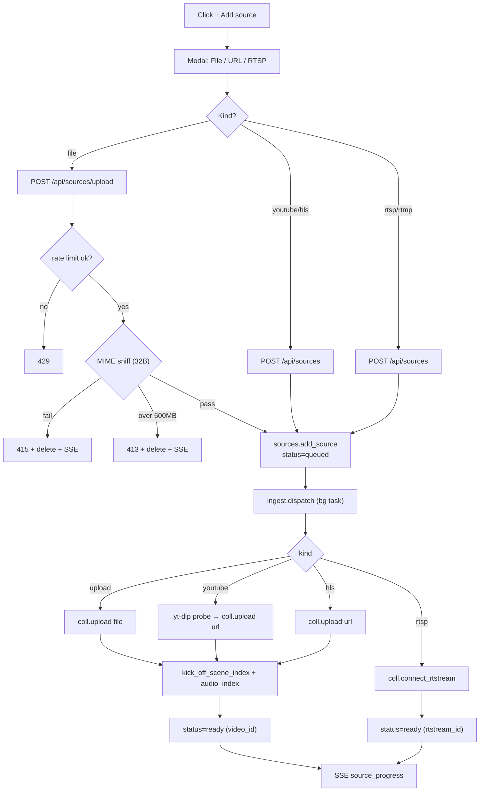

1. **Dispatch** — `dashboard.py` posts to `/api/sources/upload` (multipart) or `/api/sources` (JSON).
2. **Rate limit (upload)** — `_upload_rate_limit_check(client_ip)` in `wildwatch/rate_limit.py`. Bucket: capacity 3, refill 1/min. `_client_ip_from` honours `WILDWATCH_TRUSTED_PROXY=1` for `X-Forwarded-For`.
3. **MIME sniff** — `_looks_like_video(chunk[:32])`. Allow: `mp4 / mov / webm / mkv / avi / mpeg-ps / flv`. 415/413 paths delete the orphan source row + broadcast `source_deleted` SSE.
4. **SSRF guard** — Pydantic `SourceCreate.@field_validator` blocks per-kind URL schemes + `_host_is_private(host)` covers IPv4 textual AND IPv4-mapped IPv6 (`::ffff:127.0.0.1`).
5. **Background task** — `webhooks._spawn_bg(ingest.dispatch(source_id, coll))` tracked in a Set; `done_callback` logs exceptions.
6. **Per-kind handler** — `wildwatch/ingest.py` — upload / youtube / hls / rtstream branches.
7. **Auto-index (upload + URL)** — `_kick_off_scene_index` + `_kick_off_audio_index_async` are idempotent + best-effort. Audio gates on `_has_transcript(video)`.
8. **Post-upload sweep** — `_spawn_post_upload_analysis(video, source_id)` — see Flow 11.
9. **Per-kind action buttons** — RTSP/RTMP cards show Reconnect/Disconnect; uploads/URLs show Re-index (no reconnect — would duplicate the file). Enforced in `dashboard.py:renderSource` via `isStreamKind`.

---

## Flow 3 — Search "elephant drinking"

`coll.search` doesn't do scene/keyword over wildlife clips (raises `NotImplementedError` for non-semantic on collection). Fan out per-video.

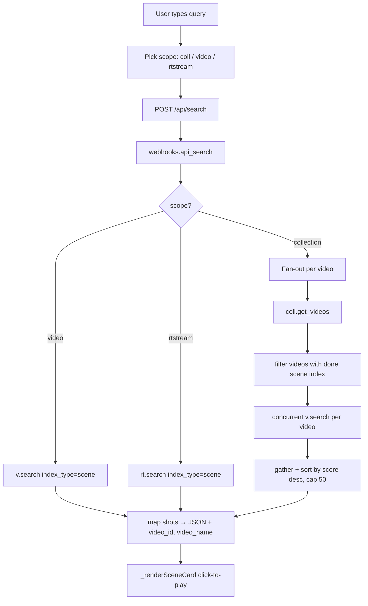

1. **Input** — search box, `dashboard.py#search-q`.
2. **Scope picker** — collection / specific upload / specific stream.
3. **Single-target** — `v.search` / `rt.search` with `index_type=scene`, `search_type=semantic`, `score_threshold=0.3`.
4. **Collection fan-out (critical)** — `coll.search` only supports `SearchType.semantic` over **spoken-word** at coll level (SDK explicitly raises `NotImplementedError` for scene/keyword). Wildlife clips have no transcripts. Skill prescription: per-video search. Implementation: enumerate `coll.get_videos()`, filter to videos with a `done` scene index, fan out concurrent `v.search` via `asyncio.gather`.
5. **Empty handling** — VideoDB raises with `"No results found"`; caught per-video as `[]`.
6. **Render** — `_renderSceneCard` reads parsed bracket-tags (visual + audio variants) → state pill + animal/sound rows + clickable HLS modal.

---

## Flow 4 — Cross-modal correlation

Two independent signals agree within window → synthesised tier-3 event. "Perception agent reasons across modalities."

```mermaid
flowchart TD
    A["run_correlation.py --stream key"] --> B["Load .state.json"]
    B --> C["30s sweep loop"]
    C --> D["For each rule in CORRELATION_RULES"]
    D --> E{"cooldown ok?"}
    E -->|no| C
    E -->|yes| F["Per query, rt.search time_range=last N s"]
    F --> G{"All queries hit?"}
    G -->|no| C
    G -->|yes| H["Build synthesised event"]
    H --> I["rt.generate_stream start, end → m3u8"]
    I --> J["POST /webhook/&#123;tier&#125; label=CONFIRMED_PREDATOR_EVENT"]
    J --> K["Normal alert pipeline"]
    K --> L["mark_fired → cooldown 5min"]
    L --> C
```

1. **Entry** — `python scripts/run_correlation.py --stream <key> --interval 30 --duration 300`.
2. **State** — `.state.json` → rtstream id + per-kind index ids.
3. **Rules** — `scripts/run_correlation.py:CORRELATION_RULES` (or `wildwatch/correlation.py`). Each rule has 2+ queries tagged with index + a `window_seconds` + `synthesis_label`.
4. **Cooldown** — `should_fire(rule_name, now, cooldown=300)` prevents re-fire within 5 min.
5. **AND-logic** — rule fires only if every query has at least one hit in window.
6. **Playable clip** — `rt.generate_stream(start=fired_at-window, end=fired_at)` → HLS URL attached as `stream_url`.
7. **Same pipeline** — synthesised event POSTed to own `/webhook/{tier}` so it flows through identical Telegram + SSE + log path as VideoDB-fired events.

---

## Flow 5 — Daily digest reel + modal + Telegram album

Operator clicks **Daily summary → Build**. 30–90s later: in-app modal + reel + Telegram album.

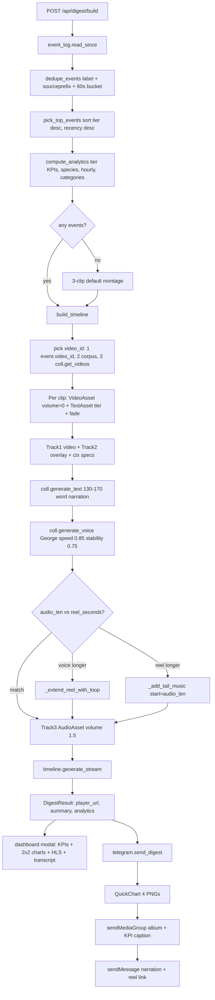

1. **Entry** — Dashboard fires `POST /api/digest/build` with `{since_hours, top_n, clip_seconds, add_text_overlays, add_voiceover, notify_telegram}`. CLI fallback: `python scripts/build_digest.py` (no Telegram, no modal).
2. **Read log** — `event_log.read_since` streams `data/live_event_log.jsonl` for `received_at >= now - since_hours*3600`. Malformed lines counted in aggregate WARNING.
3. **Dedupe** — `digest.dedupe_events` collapses `(label, source-first-48-chars, 60s bucket)` collisions → one clip per scene.
4. **Top-N** — `digest.pick_top_events` sorts by `(-tier, -received_at)`.
5. **Analytics** — `digest.compute_analytics(events)` pure aggregator: tier KPIs, top_labels, species (parsed from `species=X` + common-name mentions), hourly (24-bucket), light_modes, categories (overlapping: visual / audio / behaviour / environment / threat).
6. **Empty-log fallback** — three-tier synthetic montage so demo always has a reel.
7. **Per-event clip waterfall** — three-stage in `build_timeline`:
   - 1st choice: event's own `video_id` + `start_time` (Path-B uploads carry this — shows actual triggering scene).
   - 2nd choice: `pick_corpus_video_id(tier, corpus_state, skip)` mapped via `TIER_SLUG_PREFERENCE`. Each candidate probed by `_video_has_info` (`video.length`); skip-listed on "Video info not available".
   - 3rd choice: `_discover_collection_fallback(conn, …)` enumerates `coll.get_videos()` for any usable upload.
8. **Composition** — `VideoAsset(id, start=clip_start, volume=0)` (muted for narration) + `Clip(duration, transition=fade)` + `TextAsset` tier-label burn-in on overlay track. `build_timeline` returns `(timeline, n_clips, reel_seconds, ctx)`; `ctx` carries `{video_track, overlay_track, clip_specs, cursor}` for extension without re-probing.
9. **Narration** — `coll.generate_text(prompt=…)` 130–170 word documentary-narrator prompt, forbids bracket tags + event-engine jargon. `coll.generate_voice(text, voice_name="George", config={"speed":0.85, "stability":0.75}, wait=True)` — slow deep ElevenLabs. Retries with default config if VideoDB rejects keys.
10. **Length sync** — read `audio.length`:
    - voice longer → `_extend_reel_with_loop(ctx, audio_len)` appends clips round-robin from `clip_specs`; overlay track follows.
    - reel longer → `_add_tail_music(timeline, conn, start=audio_len, duration=gap)` generates short ambient outro.
11. **Audio track** — `AudioAsset(id, volume=1.5)` on own Track (boost above mixer baseline, range 0..5).
12. **Stream** — `timeline.generate_stream()` → HLS URL + player URL.
13. **Response** — `{n_events, n_clips, stream_url, player_url, summary, analytics, telegram_sent, telegram_error?}`.
14. **Modal** — `_openDigestModal(d)` full-screen overlay. `_digestTheme()` reads CSS vars from `:root` → flips with light/dark toggle (tier colours fixed). 4-up KPI strip → 2×2 charts (Chart.js CDN) → inline HLS player (`hls.js` or Safari-native) → transcript. Escape / overlay-click / close button destroys `Hls` + `Chart` instances.
15. **Telegram** — `telegram.send_digest`:
    - `sendMediaGroup` — album of up to 4 PNGs from `_digest_chart_urls(analytics)` (QuickChart.io). First photo carries HTML caption with header + 🔵🟡🔴 KPI line.
    - `sendMessage` — narration + tappable `▶ Watch full reel` link.
    - Fallback: `build_digest_message` ASCII-bar version if QuickChart unreachable.

---

## Flow 6 — Dashboard live updates (SSE)

Push, not poll.

```mermaid
flowchart TD
    A["Browser opens /"] --> B["new EventSource(/events/stream)"]
    B --> C["webhooks.stream_events"]
    C --> D["dashboard.subscribe (asyncio.Queue)"]
    D --> E["Listening..."]
    G["Alert at /webhook/&#123;tier&#125;"] --> H["dashboard.broadcast"]
    H --> I["for each subscriber put_nowait"]
    I --> J{"queue full?"}
    J -->|yes| K["drop + _dropped_total"]
    J -->|no| L["yield to client"]
    L --> M["EventSource onmessage"]
    M --> N["fetchStats keyed-diff render"]
```

1. **Connect** — `EventSource('/events/stream')` → `webhooks.stream_events` returns `StreamingResponse` whose generator is `dashboard.subscribe`.
2. **Queue** — new `asyncio.Queue(maxsize=…)` per subscriber added to `_subscribers`.
3. **Broadcast** — `dashboard.broadcast(payload)` fans out via `put_nowait`.
4. **Slow-subscriber** — queue full → event dropped + `_dropped_total++` + logged (deliberately non-blocking on slow clients).
5. **Render** — `EventSource.onmessage` → `fetchStats()` → keyed-render diff in `applyStats` (append-only, no flicker).

---

## Flow 7 — Cost + usage breakdown

Usage tab = three layers, three SDK calls, one cached endpoint.

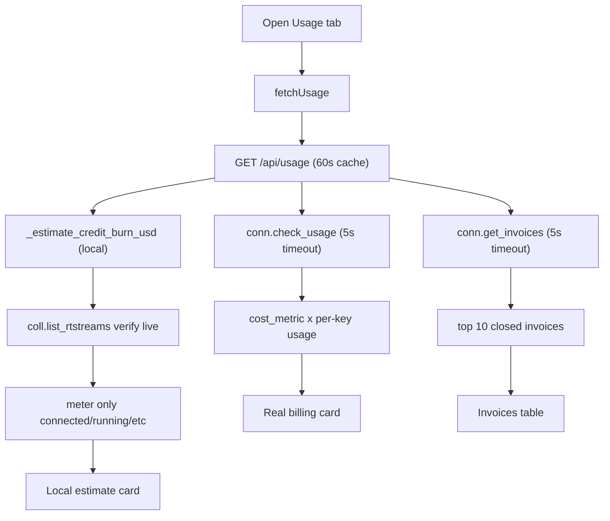

1. **GET `/api/usage`** — one response with all three layers, cached 60s.
2. **Bounded SDK pool** — all three dispatched via `_async_sdk(fn, timeout_s=5.0)`. 4-worker pool tracks `_sdk_in_flight` under `_executor_lock`; 2× saturation → `SDKPoolSaturated → 503`. `CancelledError` defers slot release via `cf_fut.add_done_callback` so counter doesn't leak.
3. **Local estimate** — `wildwatch/billing.py:_estimate_credit_burn_usd` from `.state.json` start timestamps × hourly rate. Cross-checked via `coll.list_rtstreams()`; only `connected/running/ingesting/indexing/ready` metered. SDK failure → fallback + `live_status_unknown` flag (not silent zero).
4. **Real billing** — `cost_metric × usage` per key, sorted desc. Exposes "transcription = $96" surprises.
5. **Invoices** — `_coerce_to_list` (not `or []`) so a non-list SDK return logs a warning instead of silently zeroing.

---

## Flow 8 — Bootstrap (one-shot wire-up)

`python scripts/bootstrap.py` is idempotent. Re-running never duplicates events or alerts.

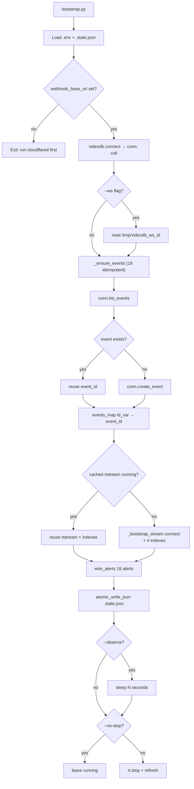

1. **Tunnel check** — refuse to proceed without `webhook_base_url` (would point alerts at dead URL).
2. **`_ensure_events`** — pre-fetches `conn.list_events()` once, then for each of 18 definitions in `wildwatch/events.py`: reuse same-label id or `conn.create_event()`. Saves to `state["events"]`.
3. **Idempotent rtstream** — saved id still `connected` → reuse. Else `_bootstrap_stream` provisions fresh + 4 indexes (species → behavior → environment → audio). `--ws` calls `rt.start_transcript(ws_connection_id=…)`.
4. **`wire_alerts`** — for each `(kind, event)` in `INDEX_EVENT_MAP`, `idx.create_alert(event_id, callback_url=f"{base_url}/webhook/{tier}")`. Idempotency keyed on `rtstream_id`. WebSocket id forwarded if present.
5. **Persist** — `wildwatch/state_io.py:atomic_write_json` (`.tmp` + fsync + rename + parent fsync, `0o600`, `O_NOFOLLOW`).

---

## Flow 9 — Click scene card → modal HLS player

Every scene card (Indexed Content + search results) clickable → inline modal — no new tabs, no raw m3u8.

```mermaid
flowchart TD
    A["Click data-action=play-scene-clip"] --> B["central click dispatcher"]
    B --> C["playSceneClip(videoId, start, end)"]
    C --> D["GET /api/videos/&#123;id&#125;/clip?start=&end="]
    D --> E["webhooks.api_video_clip"]
    E --> F{"end-start ≤ 600s?"}
    F -->|no| G1["400 segment too long"]
    F -->|yes| G2["coll.get_video → video.generate_stream timeline"]
    G2 --> H["m3u8 manifest URL"]
    H --> I["_openClipPlayer(url, title)"]
    I --> J{"Safari?"}
    J -->|yes| K1["video.src = url (native HLS)"]
    J -->|no| K2{"Hls.isSupported?"}
    K2 -->|yes| K3["new Hls + loadSource + attachMedia"]
    K2 -->|no| K4["toast HLS unsupported"]
    K1 --> M["modal opens autoplay"]
    K3 --> M
    M --> N["Esc / backdrop / X → destroy Hls + DOM"]
```

1. **Click target** — every scene card has `data-action="play-scene-clip"`, `data-video-id`, `data-start`, `data-end` via `_renderSceneCard(sc, idx, videoId)`.
2. **Dispatcher** — single delegated listener walks `e.target.closest('[data-action]')`.
3. **Endpoint** — `GET /api/videos/{id}/clip?start=&end=`. Rejects `end <= start` and `>600s`.
4. **Backend** — `webhooks.api_video_clip` → `_async_sdk(video.generate_stream, timeline=[(start, end)])`.
5. **Player** — Safari = native HLS via `<video src>`. Other = `hls.js@1.5.13` (CDN) with `new Hls({maxBufferLength: 30})`.
6. **Cleanup** — Esc / X / backdrop destroys hls instance + pauses + nullifies `<video>` src + removes DOM + detaches keydown.

---

## Flow 10 — Library: browse / filter / sort / delete

Indexed Content tab. Toolbar runs client-side against cached payload — no API call on filter/sort change.

```mermaid
flowchart TD
    A["Indexed Content tab opens"] --> B["fetchVideos"]
    B --> C["GET /api/videos (60s cache)"]
    C --> D["response videos list"]
    D --> E["client cache _libraryVids"]
    E --> F["_renderLibrary"]
    F --> T0["sticky toolbar: filter, sort, kind"]
    F --> T1["scrollable list of cards"]
    T0 -->|input/change| H["_renderLibrary again (no API)"]
    H --> T1
    T1 -->|click row| I["showVideoDetail indexes+scenes"]
    T1 -->|click delete| J["deleteVideo confirmToast danger"]
    J -->|confirm| L["DELETE /api/videos/&#123;id&#125;"]
    L --> M["coll.delete_video"]
    M --> N["_videos_cache reset"]
    N --> O["SSE video_deleted broadcast"]
    O --> P["optimistic filter + toast"]
    P --> E
```

1. **`/api/videos`** — `webhooks.api_list_videos` returns cached list (60s TTL) or refetches `coll.get_videos()`.
2. **Client cache** — `_libraryVids` holds raw payload. Toolbar filters in-memory.
3. **`_renderLibrary`** — pure function. Filter (case-insensitive substring on name OR id) → kind (`_libraryKindKey(name)` maps to `clip / uploaded / stream / reel`) → sort (name/length/id × asc/desc). Header shows `${shown} / ${total}`.
4. **Sticky toolbar** — `<header>` with `position: sticky; top: 0`. `overflow-hidden` parent + `overflow-y: auto` list = inner-scroll.
5. **Row click** — `data-action="show-video"` → `showVideoDetail(videoId)` loads indexes + scenes into right pane. Pane root stores `dataset.videoId` for delete-cleanup.
6. **Delete** — `data-stop-propagation` on delete button. Confirm toast (`danger: true`). DELETE wraps `coll.delete_video` in `_async_sdk(timeout=15s)`. Failure → 502 with SDK msg.
7. **Cache bust + SSE** — `_videos_cache=None` + broadcast `{type:"video_deleted", video_id}`. Client filters id from `_libraryVids` optimistically, then re-fetches to reconcile.
8. **Detail-pane reset** — if deleted video was open in right pane → placeholder.

---

## Flow 11 — Path B (Telegram on uploads)

`create_alert` is rtstream-only. For uploads, poll until indexes done → search → synthesise webhooks. Same `/webhook/{tier}` pipeline as VideoDB-fired alerts.

```mermaid
flowchart TD
    A["Upload or URL ingest"] --> B["coll.upload"]
    B --> C["kick_off_scene_index species"]
    B --> D["kick_off_audio_index audio"]
    C --> E["source=ready"]
    D --> E
    E --> F["_spawn_post_upload_analysis asyncio.Task"]
    F --> G["run_post_upload_analysis"]
    G --> H1["_wait_for_index scene (20m cap)"]
    G --> H2["_wait_for_index audio (8m cap)"]
    H1 --> I{"either ready?"}
    H2 --> I
    I -->|neither| Z["log + exit"]
    I -->|yes| K["loop _EVENT_QUERY"]
    K --> L{"event kind"}
    L -->|audio event| M1["v.search idx=audio threshold 0.35"]
    L -->|species/env| M2["v.search idx=visual threshold 0.35"]
    M1 --> N{"hits?"}
    M2 --> N
    N -->|no| K
    N -->|yes| O["top-scoring shot"]
    O --> P["generate_stream → m3u8"]
    P --> Q["POST /webhook/&#123;tier&#125;"]
    Q --> R["normal pipeline (event_log + Telegram + SSE)"]
    R --> S{"fire cap 12?"}
    S -->|no| K
    S -->|yes| Z
```

1. **Two indexes** — `_kick_off_scene_index` + `_kick_off_audio_index_async` (idempotent, best-effort).
2. **Sweep** — `_spawn_post_upload_analysis(video, source_id)` fire-and-forget asyncio Task tracked in module-level set (`_post_analysis_tasks`) so GC can't drop.
3. **`_wait_for_index(video, name_substr, cap_s)`** — polls `video.list_scene_index()` every 8s. Returns metadata when status in `{ready, indexed, complete, completed, done}`; `None` on `failed`/`error`/timeout. Scene cap 20 min, audio cap 8 min.
4. **`_EVENT_QUERY`** — hand-curated map from event `id_var` to natural-language search query (events.py prompts are written for event engine, not free-text search).
5. **`_EVENT_INDEX_KIND`** — routes audio events → audio index, species/environment → visual.
6. **`video.search(query, index_type=scene, scene_index_id=…, score_threshold=0.35)`** — semantic search over bracket-tagged AI output. SDK `InvalidRequestError` with `"No results found"` → `[]`.
7. **Top shot** — `max(shots, key=search_score)` — one synthesised event per event-of-interest, not per hit (Telegram-flood guard).
8. **`generate_stream(timeline=[(start, end)])`** — playable HLS for matched segment.
9. **Synthesised POST** — payload: `label, tier, confidence, explanation, video_id, start_time, end_time, stream_url`. Target = `LOCAL_WEBHOOK_URL` (default `http://localhost:8000`).
10. **Fire cap** — `_MAX_FIRES_PER_UPLOAD = 12`.

**Why polling instead of callback?** `video.index_*` accepts `callback_url` but (a) requires public webhook URL — Path B exists to work **without** cloudflared, (b) we want to fire on hits, not just "index done".

**Audio gotcha** (verified from SDK source): `video.index_audio` + `rtstream.index_audio` both use `extraction_type=SceneExtractionType.transcript` — they process transcript via LLM with audio prompt; do NOT run waveform classification. Silent / SFX-only clips → no transcript → audio index stuck in `processing` forever. `_has_transcript(video)` gates kickoff; sweep falls back to running audio-event queries against visual index. **No native non-speech audio classification in VideoDB.**

**Stuck audio indexes** — `purge_stuck_audio_indexes(video, source_id)` deletes any audio-named index in `processing/queued/pending/initiated` (VideoDB has no cancel-job API). Triggered implicitly on every kickoff + manually via dashboard "Re-index audio" CTA (`POST /api/videos/{id}/reindex?kind=audio` → `kick_off_audio_index(force=True)`).

---

## How to use these

- **New engineer?** Read `REPO_MAP.md` first, then this for *why*+*when*.
- **Non-technical reviewer?** Read numbered walkthroughs, skip diagrams.
- **Demo prep?** Flows 1 + 4 matter most for the 90s video.
- **Debugging?** Each numbered step has `file:function` anchor.
