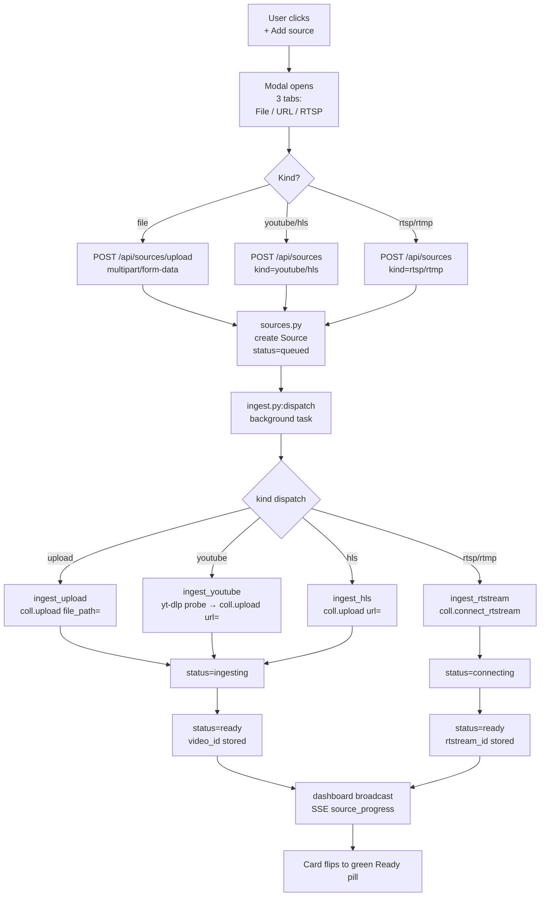
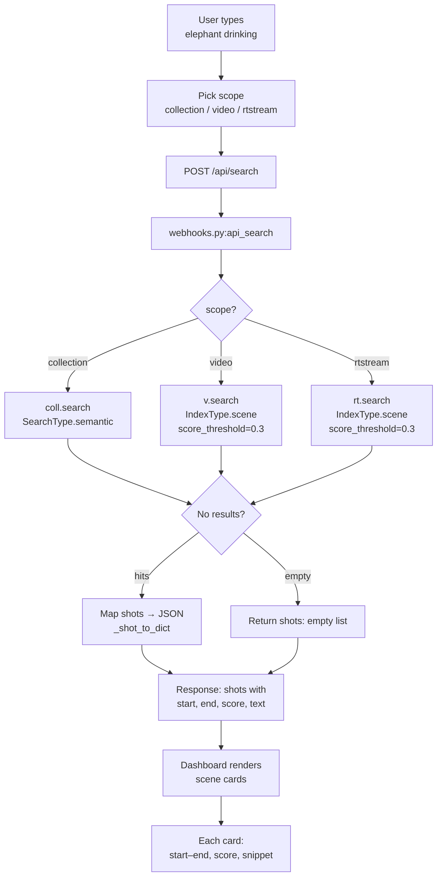
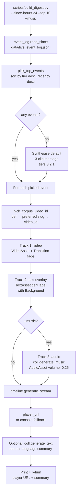
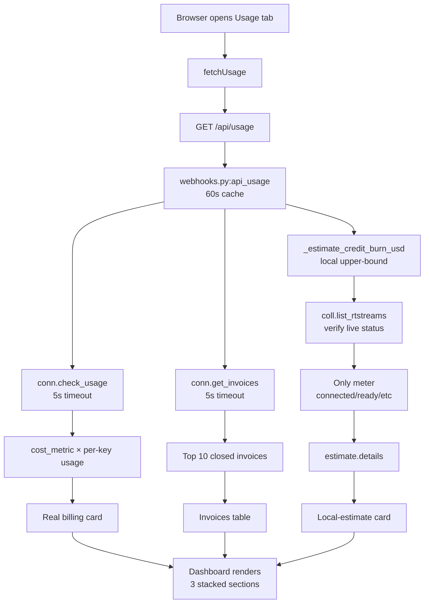
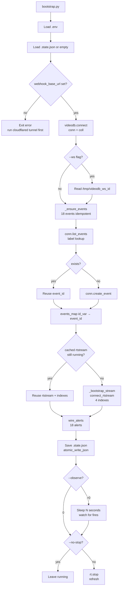

# Feature Flows — How everything actually happens, step by step

> **Audience:** anyone wanting to understand how WildWatch *behaves* — not just where the files live (that's `REPO_MAP.md`) but the end-to-end "thing happens → thing happens → thing happens" sequence behind every visible feature.

GitHub renders Mermaid diagrams natively, so the charts below will appear as drawn pictures when you read this file on GitHub. The numbered walkthroughs after each chart explain every step in plain English with a pointer to the exact source-code location.

---

## Flow 1 — A wild animal is seen, a phone buzzes

The headline pipeline. From "camera films a leopard" to "ranger's Telegram buzzes" in under 30 seconds.

```mermaid
flowchart TD
    A[Wildlife livestream<br/>HDOnTap RTSP / YouTube Live] -->|RTSP URL| B(VideoDB<br/>connect_rtstream)
    B --> C{Sandbox<br/>active?}
    C -->|no| D[sandbox.py<br/>create + wait_for_ready]
    C -->|yes| E
    D --> E[Frames arrive in VideoDB]
    E --> F1[Species index<br/>prompts/species.txt<br/>every 5s]
    E --> F2[Behavior index<br/>prompts/behavior.txt<br/>every 5s]
    E --> F3[Environment index<br/>prompts/environment.txt<br/>every 60s]
    E --> F4[Audio index<br/>prompts/audio.txt<br/>every 30s]
    F1 --> G{18 event rules<br/>events.py}
    F2 --> G
    F3 --> G
    F4 --> G
    G -->|match| H[VideoDB fires alert<br/>POST callback_url]
    H --> I[webhooks.py<br/>POST /webhook/&#123;tier&#125;]
    I --> J[event_log.py<br/>append JSONL]
    I --> K[telegram.py<br/>send_alert]
    I --> L[dashboard.py<br/>broadcast SSE]
    K --> M[Operator's<br/>Telegram chat]
    L --> N[Browser dashboard<br/>live event feed]
```

### Node-by-node

1. **Wildlife livestream** — an HDOnTap RTSP stream or a YouTube Live URL bridged through `mediamtx` so VideoDB can read it. URLs and per-stream context (location, expected species) are configured in `config.py`.
2. **VideoDB `connect_rtstream`** — the SDK call that hands the stream over to VideoDB's ingest. Invoked from `scripts/bootstrap.py:_bootstrap_stream`. The returned `rt` object is the handle we use for every subsequent index/alert.
3. **Sandbox check** — VideoDB charges per-hour for a "sandbox" — the dedicated GPU slot that runs perception models. We use exactly one, lazily created, status-gated. Logic in `wildwatch/sandbox.py`.
4. **Sandbox creation** — if no sandbox exists or the cached one expired (10-min idle TTL on VideoDB's side), `sandbox.py:ensure_sandbox` creates a new one and blocks until `is_active == True`. This is the only place sandbox lifecycle lives — every other module accepts a `sandbox_id` parameter.
5. **Frames arrive in VideoDB** — once `rt.status == "connected"` you can ask for indexes.
6–9. **Four parallel indexes** — `rt.index_visuals(prompt=...)` is called three times (species, behavior, environment) and `rt.index_audio(prompt=...)` once. Each one is a separate AI "lens" with its own batch frequency. Code: `scripts/bootstrap.py:_bootstrap_stream` lines 158–180.
10. **18 event rules** — defined as a list of dicts in `wildwatch/events.py`. Each event has a tier, a label, and a prompt sentence that VideoDB's event engine evaluates against incoming index outputs. Wired to indexes by `wildwatch/wiring.py:wire_alerts`.
11. **VideoDB fires the alert** — when an event matches, VideoDB POSTs to whatever `callback_url` was registered when the alert was created. For us that's `https://<tunnel>/webhook/{tier}`.
12. **`/webhook/{tier}` receiver** — `wildwatch/webhooks.py:receive_alert` accepts the POST, validates the payload schema (`AlertPayload`), and starts fan-out.
13. **Append to event log** — `wildwatch/event_log.py:append` writes the alert as one JSON line. This file is the digest builder's source of truth.
14. **Send to Telegram** — `wildwatch/telegram.py:send_alert` formats a markdown message with tier emoji, label, explanation, and a clickable VideoDB player link. Posts to the Telegram Bot API.
15. **Broadcast to dashboard** — `wildwatch/dashboard.py:broadcast` pushes the event to every SSE subscriber (every open browser tab on the dashboard). Slow subscribers get dropped events (counted in `/api/stats`).
16. **Operator's Telegram chat** — the phone buzzes.
17. **Browser dashboard** — the new event card appears at the top of the live feed (fade-in animation), the tier counter increments, KPI updates.

---

## Flow 2 — Operator adds a new source from the dashboard

A user pastes a YouTube URL, uploads an MP4, or types in an RTSP address. The dashboard walks the source from "queued" all the way to "ready and searchable."

### Node-by-node

1. **User clicks +Add source** — button in the Sources tab (`dashboard.py` near the `add-source-btn` id).
2. **Modal opens** — three-tab modal: file upload, URL paste, RTSP/RTMP. The active tab is tracked in JS (`modalKind`).
3. **Kind dispatch** — the front-end picks the right endpoint and body shape. URL-paste auto-detects YouTube vs HLS by domain.
4. **POST endpoint** — `webhooks.py:api_create_source` (JSON body) or `webhooks.py:api_create_source_upload` (multipart). Both validate inputs.
5. **Source created** — `sources.py:create_source` writes a new entry to `.state.json["sources"][<uuid>]` with `status="queued"`. Immediately returns the id.
6. **Dispatch background task** — `webhooks.py:_spawn_bg(ingest.dispatch(source_id, coll))`. The task is tracked in a Set so the garbage collector doesn't drop it mid-flight; the `done_callback` logs any exception.
7–10. **Per-kind handler** — `ingest.py` has four dispatch branches:
    - `ingest_upload`: streams the temp file to VideoDB via `coll.upload(file_path=...)`.
    - `ingest_youtube`: probes the URL with `yt-dlp` first to surface 403s before billing VideoDB, then `coll.upload(url=...)`.
    - `ingest_hls`: HEAD-checks the manifest, then `coll.upload(url=...)`.
    - `ingest_rtstream`: `coll.connect_rtstream(url=..., media_types=["video","audio"], store=True)` and waits for `status="connected"`.
11–12. **Progress states** — each handler updates the source's `status` field (`queued → connecting → ingesting → indexing → ready`) and broadcasts a `source_progress` SSE event after every change.
13–14. **Ready** — the source now has a `video_id` (for uploads/URLs) or `rtstream_id` (for live streams) and is searchable.
15. **Card flips to ready** — the dashboard re-fetches `/api/sources` on `source_progress`, the new green "ready" pill appears.

---

## Flow 3 — Search "elephant drinking"

The operator types a phrase into the Indexed Content tab. Behind the scenes, VideoDB's per-scene index does the heavy lifting.

### Node-by-node

1. **User input** — the search box at the top of the Indexed Content tab (`dashboard.py`, `search-q` id).
2. **Scope picker** — three options, all rewritten in plain English on the dashboard ("Search everywhere" / "A specific uploaded video" / "A specific live stream").
3. **POST request** — JSON body: `{query, scope, target_id?, index_id?}`.
4. **Receiver** — `webhooks.py:api_search`.
5. **Scope dispatch** — the right SDK method per scope. **Critical detail**: collection search only supports `SearchType.semantic` (the SDK raises `NotImplementedError` without it), and scene-level search needs `IndexType.scene` + `score_threshold` per the VideoDB skill's reference docs.
6–8. **VideoDB returns matches** — a list of "shots" (timestamped excerpts).
9. **Empty-result handling** — VideoDB raises an exception (not an empty list) when nothing matches. We catch the `"No results found"` string specifically and return `shots: []` so the dashboard renders a clean "no results" state.
10. **Normalize shots** — `_shot_to_dict` extracts `start`, `end`, `score`, `text`, `scene_index_name`.
11. **Response** — JSON to the front end.
12–13. **Dashboard rendering** — each shot becomes a card showing `start–end · score · index name` and the matching text snippet.

---

## Flow 4 — Cross-modal correlation ("confirmed predator event")

Single-signal alerts are noisy. This loop fires only when **two independent signals** agree within a time window — the "perception agent reasons across modalities" pitch.

```mermaid
flowchart TD
    A[scripts/run_correlation.py<br/>--stream mara_live] --> B[Load .state.json<br/>resolve rtstream + index ids]
    B --> C[Every 30s sweep]
    C --> D[For each rule in CORRELATION_RULES]
    D --> E{Cooldown OK?}
    E -->|no| C
    E -->|yes| F[For each query in rule]
    F --> G[rt.search<br/>per-index<br/>time_range=last N s]
    G --> H{All queries<br/>have hits?}
    H -->|no| C
    H -->|yes| I[Build synthesised event]
    I --> J[rt.generate_stream<br/>start=fired_at-window<br/>end=fired_at]
    J --> K[POST /webhook/&#123;tier&#125;<br/>label=CONFIRMED_PREDATOR_EVENT<br/>stream_url=playable clip]
    K --> L[Normal alert pipeline<br/>Telegram + dashboard]
    L --> M[Mark rule fired<br/>start cooldown]
    M --> C
```

### Node-by-node

1. **Entry point** — `python scripts/run_correlation.py --stream <key> --interval 30 --duration 300`.
2. **State load** — reads `.state.json` to find the rtstream id and per-kind index ids for the named stream.
3. **30-second sweep loop** — configurable. Each tick walks every correlation rule.
4. **Rule iteration** — rules are defined in `scripts/run_correlation.py:CORRELATION_RULES` (or imported from `wildwatch/correlation.py`).
5. **Cooldown check** — `should_fire(rule_name, now, cooldown=300)` prevents the same rule from firing twice in 5 minutes.
6. **Per-query iteration** — each rule has 2+ queries, each tagged with which index it runs against. Example: `("audio", "alarm_call OR predator_vocalization")` paired with `("behavior", "fleeing OR alarm_response")`.
7. **`rt.search`** — VideoDB scene search, time-windowed to the rule's window (typically 90 s).
8. **All-match check** — the rule only fires if *every* query has at least one hit. AND-logic across modalities.
9. **Synthesised event** — builds the payload: `event_id = "corr-<rule>-<ts>"`, `label = rule.synthesis_label`, evidence summary in `explanation`.
10. **Generate playable clip** — `rt.generate_stream(start=fired_at - window_s, end=fired_at)` returns an HLS URL pointing at the actual moment. Attached as `stream_url` so the Telegram message has a tap-to-play link.
11. **POST to our own webhook** — the synthesised event flows through the same `/webhook/{tier}` pipeline as VideoDB-fired ones. Same logging, same Telegram, same dashboard broadcast. No special-case downstream code.
12. **Normal alert pipeline** — Flow 1 from step 12 onwards.
13. **Cooldown set** — `mark_fired(rule_name, at=now)` so the rule rests for `--cooldown` seconds.

---

## Flow 5 — Daily highlight reel

End-of-day operator hits "build digest" (or a cron does). 90 seconds later there's a playable, narrated, music-backed reel of the day's most important events.

### Node-by-node

1. **Entry point** — `python scripts/build_digest.py --since-hours 24 --top 10 [--music] [--no-overlays]`.
2. **Read event log** — `wildwatch/event_log.py:read_since` reads `data/live_event_log.jsonl` and returns every event with `received_at >= now - since_hours*3600`. Tolerates malformed lines (skips them with a warning).
3. **Pick top events** — `digest.py:pick_top_events` sorts by `(-tier, -received_at)` and keeps the first N. Urgent events ALWAYS appear before notable ones.
4. **Empty-log fallback** — if no events fired today, build a default 3-clip montage (one per tier) so the demo always has a reel to show.
5. **Event iteration** — one clip per picked event.
6. **Pick corpus clip** — `digest.py:pick_corpus_video_id` maps the event's tier to a list of preferred corpus slugs (from `TIER_SLUG_PREFERENCE`) and returns the first that has a `video_id` in `state["corpus"]`. Falls back to "any clip" if no slug matches.
7. **Track 1 — video** — `VideoAsset(id=video_id, start=0)` wrapped in a `Clip(duration=4s, transition=fade-in/out)`. Added to the video `Track`.
8. **Track 2 — text overlay** — `TextAsset(text="🟦 INFO\n<event label>", font=…, background=…)` with the same fade transition. The tier color (#38bdf8 / #f59e0b / #ef4444) sets the background. Renders as a burn-in label so a non-tech viewer instantly understands what each clip represents.
9–10. **Track 3 — music (optional)** — `coll.generate_music(prompt="documentary ambient...", duration=total)` returns an `Audio` object whose id we wrap in `AudioAsset(volume=0.25)`. Failure is non-fatal — the reel just plays silent.
11. **Generate stream** — `timeline.generate_stream()` is VideoDB's "compile and serve" call. Returns an HLS URL.
12. **Player URL** — preferred path is `timeline.player_url` (skill convention). Fallback to hand-built `console.videodb.io/player?url=...`.
13. **Natural-language summary (optional)** — `coll.generate_text(prompt="Summarise this digest in one paragraph...")` produces a one-paragraph caption for the reel. Failure is silent.
14. **Output** — prints both URL and summary; returns them in the result dict.

---

## Flow 6 — Dashboard live updates (SSE)

The dashboard never polls for alerts. New events push from server to browser through a Server-Sent Events stream.

```mermaid
flowchart TD
    A[Browser opens<br/>http://localhost:8000/] --> B[Page loads HTML/JS]
    B --> C[startSSE<br/>new EventSource<br/>/events/stream]
    C --> D[webhooks.py<br/>stream_events]
    D --> E[dashboard.subscribe<br/>asyncio.Queue]
    E --> F[Listening...]
    G[Alert arrives at<br/>/webhook/&#123;tier&#125;] --> H[dashboard.broadcast]
    H --> I[For each subscriber Queue]
    I --> J[put_nowait event]
    J --> K{Queue full?}
    K -->|yes| L[Drop + log<br/>increment _dropped_total]
    K -->|no| M[Yield to client]
    M --> N[Browser onmessage]
    N --> O[Refresh feed via<br/>fetchStats]
    F --> M
```

### Node-by-node

1. **Browser opens** — index page served from `webhooks.py:dashboard_index`.
2. **Page loads** — embedded JS in `dashboard.py` runs `applyThemeIcons`, `restoreTab`, `startSSE`, `fetchStats`, etc.
3. **EventSource connect** — `new EventSource('/events/stream')` opens a long-lived HTTP connection.
4. **Server endpoint** — `webhooks.py:stream_events` returns a `StreamingResponse` whose generator is `dashboard.py:subscribe`.
5. **Subscribe** — a new `asyncio.Queue(maxsize=...)` is added to `_subscribers`. The generator `async for ev in subscribe()` yields each event back to the browser as it arrives.
6. **Idle wait** — the queue is empty; the generator blocks.
7. **Alert arrives** — Flow 1, step 12. `webhooks.py:receive_alert` calls `dashboard.broadcast(payload)`.
8. **Broadcast fan-out** — iterates every subscriber queue and `put_nowait`s the event.
9–10. **Slow-subscriber handling** — if a browser tab is too slow to drain (queue full), the event is **dropped** and `_dropped_total` is incremented + logged. We deliberately don't block the webhook handler on slow clients.
11–12. **Browser receives** — `EventSource.onmessage` fires.
13. **Refresh** — the JS calls `fetchStats()` which re-renders the live feed. The keyed-render diff in `applyStats` only appends new events (no full re-render flicker).

---

## Flow 7 — Cost & usage breakdown

The Usage tab shows three layers of cost info, each derived from a different VideoDB API.

### Node-by-node

1. **Browser opens Usage tab** — triggers `fetchUsage()`.
2. **Single GET** — `/api/usage` returns all three layers in one response (cached 60 s server-side).
3. **Server handler** — `webhooks.py:api_usage`.
4. **Three parallel data sources**:
    - **`_estimate_credit_burn_usd`** — local upper-bound from `.state.json` start timestamps × hourly rate. Cross-checked against `coll.list_rtstreams()` to skip non-running entries.
    - **`conn.check_usage()`** — VideoDB's real per-period total + price card + balance + plan. 5-second timeout.
    - **`conn.get_invoices()`** — list of closed billing periods. 5-second timeout.
5. **Live-status verification** — for each `rtstreams` entry in `.state.json`, only meter it if VideoDB confirms it's in `connected/running/ingesting/indexing/ready` state. Stale entries are skipped. If the SDK call fails, fall back to the legacy upper-bound and emit a `warning` field so the dashboard can show a banner.
6. **Real-billing math** — for each `key` in `cost_metric`, compute `usage[key] × cost_metric[key]`. Sort descending. This is the breakdown that exposes the "transcription = $96" surprise from prior smoke runs.
7. **Closed-invoice list** — top 10 invoices, normalised to a `{description, when, amount}` shape by `dashboard.py:renderInvoices`.
8–10. **Three cards rendered**: real-billing breakdown (top), local-estimate (middle), invoices (bottom). The technical-details `
` element holds the raw SDK JSON for engineers.

---

## Flow 8 — Bootstrap (one-shot wire-up)

What happens when you run `python scripts/bootstrap.py [--observe 60]` on a clean repo. The script is idempotent — re-running it never duplicates events or alerts.

### Node-by-node

1. **Entry** — `python scripts/bootstrap.py --observe 60 [--ws]`.
2. **Load env** — `.env` → `VIDEO_DB_API_KEY`, `TELEGRAM_*`, optional `WILDWATCH_ALLOWED_ORIGINS`.
3. **Load state** — `.state.json` if present, otherwise empty dict.
4. **Tunnel check** — refuse to proceed if no `webhook_base_url`; otherwise the alerts we create would point at a dead URL.
5. **VideoDB connect** — `videodb.connect()` + `get_collection()`. Cached for the rest of the script.
6. **Optional WebSocket id** — if `--ws`, read `/tmp/videodb_ws_id` written by `wildwatch/ws_listener.py`. This id gets threaded through every subsequent index and alert call.
7. **`_ensure_events`** — pre-fetches `conn.list_events()` once, then for each of the 18 definitions in `wildwatch/events.py`: if a same-labelled event already exists, reuse its id; otherwise `conn.create_event()`. Saves the mapping into `state["events"]`.
8. **Idempotent rtstream** — if a previous bootstrap saved an rtstream id and it's still `connected`, reuse it. Otherwise call `_bootstrap_stream` to provision a fresh one with all four indexes.
9. **`_bootstrap_stream`** — `rt = coll.connect_rtstream(url, media_types=["video","audio"], store=True)`, then four index calls in order (species → behavior → environment → audio). If `--ws`, also calls `rt.start_transcript(ws_connection_id=...)`.
10. **`wire_alerts`** — `wildwatch/wiring.py`. For each `(kind, event)` pair in `INDEX_EVENT_MAP`, creates an alert with `callback_url=f"{base_url}/webhook/{tier}"`. Idempotency keyed on `rtstream_id`. WebSocket id forwarded if present.
11. **Save state** — `wildwatch/state_io.py:atomic_write_json` writes `.state.json` durably.
12. **Observe loop** — if `--observe > 0`, sleeps that many seconds while alerts may fire.
13. **Teardown** — `rt.stop()` and `rt.refresh()` unless `--no-stop` is set.

---

## How to use these diagrams

- **New engineer joining?** Read REPO_MAP first to find where everything lives, then come here for the *why* and *when*.
- **Non-technical reviewer?** Each flow has a plain-English numbered walkthrough — read just the numbered list and skip the Mermaid graph if you prefer.
- **Demo prep?** Flows 1 and 4 are the two that matter most for the 90-second video.
- **Debugging?** Each numbered step has a `file:function` reference — paste into your editor's "go to symbol" and you'll land on the exact code.
